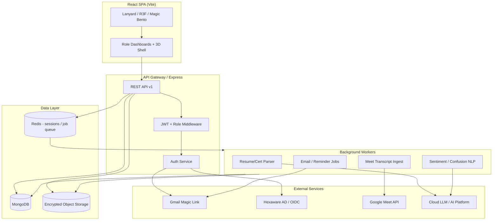
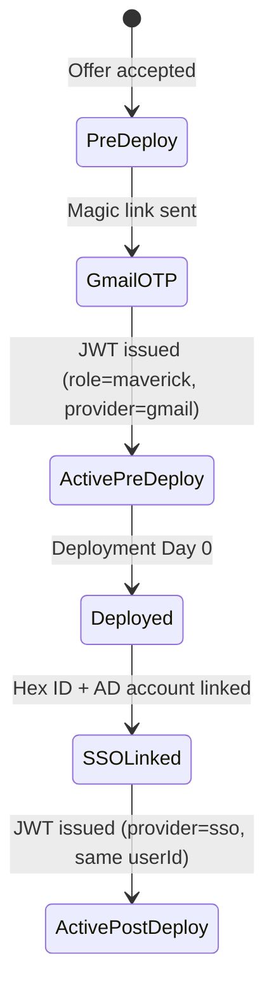

# NextSteps Legacy Audit & Target Architecture Appendix

> **For:** VP of Product (ALSAA-4) — sections 2, 6, 7 of the NextSteps Maverick Experience Platform spec  
> **Author:** CTO (ALSAA-8)  
> **Date:** 2026-05-29  
> **Codebase:** `C:\Users\2000147951\Projects\NextSteps`  
> **Work mode:** Planning only — no implementation in this deliverable

---

## Executive summary

The legacy NextSteps app is a **frontend-only React 19 + Vite SPA** with **zero backend**, **no database**, and **mock role-based login**. It demonstrates strong UI/UX patterns (3D lanyard, gamification surfaces, role dashboards) but cannot ship as-is. The revamp must **add a full MERN stack**, **remove Mentor role entirely**, **rename Supervisor → Manager** and **L&D Manager → L&D Executive**, and **replace all mock data** with authenticated APIs, encrypted storage, and background job pipelines.

---

## 1. Current-state inventory

### 1.1 Tech stack (as-is)

| Layer | Technology | Notes |
|-------|------------|-------|
| Build | Vite 8, ESLint 10 | No SSR, no API proxy |
| UI | React 19, React Router 6 | Client-side routing only |
| Styling | Custom CSS (`index.css`) | **Not Tailwind** — target spec calls for Tailwind |
| 3D / motion | R3F, drei, rapier, Three.js, GSAP, Framer Motion | Lanyard, Magic Bento, Hyperspeed |
| Charts | Recharts | Session analytics, L&D dashboards |
| Avatars | DiceBear Personas | Deterministic from user ID |
| Data | `src/data/mockData.json` | Single static JSON (~230 lines) |
| Auth | In-memory React state | Role picker + fake OTP — no JWT, no SSO |
| Backend | **None** | No Express, no MongoDB, no APIs |
| Tests | **None** | No test runner configured |
| CI/CD | **None** | No pipeline YAML in repo |

### 1.2 Application structure

```
src/
├── App.jsx              # Role-gated routes, mock login, splash gate
├── main.jsx             # BrowserRouter + ThemeProvider
├── context/
│   ├── AuthContext.jsx  # Empty createContext shell
│   └── ThemeContext.jsx # Light/dark theme
├── components/          # Shared UI (Layout, Lanyard, MagicBento, Hyperspeed, …)
├── pages/
│   ├── LoginPage.jsx
│   ├── maverick/        # 9 pages
│   ├── trainer/         # 6 pages
│   ├── ld/              # 6 pages
│   ├── supervisor/      # 2 pages
│   └── mentor/          # 1 page — **REMOVE**
├── data/mockData.json   # All domain entities
└── theme/brandPalette.js
```

**49 source files** under `src/` (excluding assets).

### 1.3 Routes by role (legacy)

| Role (legacy name) | Routes | Page components |
|--------------------|--------|-----------------|
| **Maverick** | `/`, `/passport`, `/pulse-feedback`, `/deep-feedback`, `/skill-tree`, `/stream-recommender`, `/ai-buddy`, `/leaderboard`, `/phase-timeline` | 9 |
| **Trainer** | `/`, `/session-logger`, `/batch-pulse`, `/session-analytics`, `/assessments`, `/attendance` | 6 |
| **L&D Manager** | `/`, `/batch-segregation`, `/curriculum-copilot`, `/effectiveness`, `/batch-comparison`, `/reports` | 6 |
| **Supervisor** | `/`, `/review/:maverickId` | 2 |
| **Mentor** | `/` | 1 — **DELETE** |

Auth flow: `LoginPage` → role select → fake email/OTP → `SignInSplash` → `Layout` + role routes.

### 1.4 Domain model (implicit in mockData.json)

| Entity | Key fields | Used by |
|--------|------------|---------|
| `currentUser` / `mavericks` | id, name, email, batch, track, phase, xp, level, skills, badges, streak | Maverick, Trainer, L&D, Supervisor, Mentor |
| `batches` | id, name, phase, health, trainer, readiness | Trainer, L&D |
| `sessions` | id, title, trainerId, batch, moodDistribution, clarity/pace | Trainer, Maverick feedback |
| `trainers` | id, hexId, specialization, batches | L&D |
| `quizzes` | id, session, avgScore, submissions | Trainer |
| `feedbackPulse` | sessionId, maverickId, mood, clarity, pace, openText | Trainer pulse board |
| `leaderboard` | rank, xp, streak | Maverick |
| `badges` | id, name, rarity, criteria | Gamification |
| `skillTree` | phases, nodes, status, score | Maverick |
| `streamRecommendation` | stream, fit, reason | Maverick |
| `transcripts` | sessionId, summary, confusionTimestamps | Session intelligence (UI only) |
| `supervisors` / `supervisorReviews` | assignedMavericks, monthly ratings | Supervisor |
| `mentors` / `mentorBriefs` | mentees, riskLevel, journal | **Mentor — REMOVE** |
| `phases` | onboarding lifecycle | Maverick timeline |
| `aiLearningBuddyHistory` | chat messages | Maverick AI Buddy |
| `curriculumInsights` | module, recommendation, confidence | L&D copilot |
| `effectivenessData` | batch, readinessScore, supervisorRating | L&D effectiveness |

### 1.5 Auth & security (as-is)

- **No real authentication** — `App.jsx` hardcodes 5 demo users by role string.
- **No authorization middleware** — routes gated only by client-side `user.role`.
- **No encryption, no PII handling, no audit logs.**
- Login UI simulates Magic Link OTP but auto-verifies in demo mode.

### 1.6 Notable UI assets to preserve

| Asset | Location | Recommendation |
|-------|----------|----------------|
| Lanyard (R3F + Rapier physics) | `components/lanyard/` | **Keep** — extend to login per role |
| Magic Bento spotlight system | `components/magic-bento/` | **Keep** — shell engagement pattern |
| Hyperspeed WebGL background | `components/Hyperspeed.tsx` | **Keep** — brand motion |
| Brand palette (60-30-10 triad) | `theme/brandPalette.js` | **Keep** — migrate to design tokens |
| PersonAvatar (DiceBear) | `components/PersonAvatar.jsx` | **Keep** — or replace with uploaded photo post-SSO |
| SignInSplash | `components/SignInSplash.jsx` | **Refactor** — tie to real auth session |

---

## 2. Gap analysis vs target roles

| Area | Legacy state | Target state | Action |
|------|--------------|--------------|--------|
| **Roles** | 5 roles incl. Mentor; "Supervisor", "L&D Manager" | 4 roles: Maverick, Trainer, L&D Executive, Manager | **Replace** naming + delete Mentor |
| **Mentor module** | Full dashboard, mockData entities | Omitted entirely | **Remove** routes, nav, mock data, copy |
| **Supervisor → Manager** | `supervisor` role key, "Supervisor" labels | `manager` role, "Manager" labels | **Rename** throughout stack |
| **L&D Manager → L&D Executive** | `ld` role, "L&D Manager" nav title | `ld_executive` or `ld`, "L&D Executive" | **Rename** UI + API |
| **Backend** | None | Express + MongoDB + JWT + jobs | **Build new** |
| **Auth** | Mock role picker | Gmail Magic Link OTP → Hexaware SSO at deployment | **Build new** |
| **Data persistence** | Static JSON import | MongoDB + encrypted object storage | **Build new** |
| **AI Buddy** | Hardcoded `aiResponses` array | LLM API + RAG over session content | **Replace** |
| **Batch segregation** | Static UI | Resume/certificate parsing pipeline | **Replace** |
| **Transcripts** | Static mock summaries | Google Meet API + NLP jobs | **Build new** |
| **Feedback analytics** | Client-side aggregation of mock | Server-side anonymized aggregation | **Build new** |
| **Styling** | Custom CSS classes | Tailwind CSS (per spec) | **Refactor** incrementally or greenfield shell |
| **CodePen embeds** | Not present | Assessment publisher integration | **Add new** |
| **Privacy controls** | None | RBAC + field-level redaction + encryption at rest | **Build new** |

### 2.1 Mentor removal checklist (mandatory)

Delete or exclude from target spec:

- `src/pages/mentor/MentorDashboard.jsx`
- Mentor route block in `App.jsx`
- Mentor nav in `Layout.jsx` `navConfig`
- Mentor role card in `LoginPage.jsx`
- `mockData.mentors`, `mockData.mentorBriefs`
- Phase 4 description reference to "mentor-supervised" → reword to "Manager-supervised" or "project lead"

### 2.2 Supervisor → Manager migration

- Rename role enum: `supervisor` → `manager`
- Rename paths: `/review/:maverickId` stays; folder `supervisor/` → `manager/`
- Rename entities: `supervisors` → `managers`, `supervisorReviews` → `managerReviews`
- Align with post-deployment Maverick assignment workflow

---

## 3. Target MERN architecture

### 3.1 Component diagram



### 3.2 Service boundaries

| Service | Responsibility | Stack |
|---------|----------------|-------|
| **nextsteps-web** | React SPA, Tailwind, R3F shell | Vite, React 19, R3F |
| **nextsteps-api** | REST API, auth, RBAC, validation | Express, JWT, Zod/Joi |
| **nextsteps-worker** | Async pipelines | BullMQ + Redis or node-cron |
| **nextsteps-infra** | IaC, secrets, CI/CD | Azure/AWS per org standard |

### 3.3 MongoDB collections (target)

| Collection | Purpose | Key indexes |
|------------|---------|-------------|
| `users` | All personas; auth provider refs | `email`, `hexId`, `role`, `authProvider` |
| `maverick_profiles` | XP, skills, badges, stream, deployment state | `userId`, `batchId` |
| `batches` | Lifecycle, trainer assignment, health metrics | `code`, `phase`, `status` |
| `sessions` | Training sessions, attendance, analytics aggregates | `batchId`, `date`, `trainerId` |
| `feedback_pulse` | Per-session Maverick pulse | `sessionId`, `maverickId` |
| `feedback_deep` | Phase-end structured feedback | `maverickId`, `phaseId` |
| `assessments` | Quizzes, CodePen embed refs, scores | `sessionId`, `batchId` |
| `transcripts` | Meet transcript raw + AI summary | `sessionId` |
| `documents` | Resume/certificate metadata + storage key | `maverickId`, `type` |
| `manager_reviews` | Post-deploy performance reviews | `maverickId`, `managerId`, `period` |
| `curriculum_insights` | AI-generated L&D recommendations | `moduleId`, `status` |
| `audit_logs` | Access to sensitive fields | `userId`, `resource`, `timestamp` |

### 3.4 Background jobs

| Job | Trigger | Output |
|-----|---------|--------|
| `parse-resume` | Document upload | Skill vector → `maverick_profiles.skills` |
| `segregate-batch` | L&D batch creation | Batch assignments + stream recommendations |
| `ingest-meet-transcript` | Calendar/webhook post-session | `transcripts` + confusion timestamps |
| `analyze-session-sentiment` | Transcript ready | Batch-aggregated mood/clarity signals |
| `send-feedback-reminder` | Cron / session end | Email to Mavericks with pending pulse |
| `compute-leaderboard` | XP event | Denormalized leaderboard cache |
| `auth-provider-migrate` | Deployment event | Link Gmail account → SSO identity |

---

## 4. Authentication design

### 4.1 Dual-state Maverick auth



| Phase | Provider | Identity key | Notes |
|-------|----------|--------------|-------|
| Pre-deployment | Gmail Magic Link OTP | `email` (personal Gmail) | Restrict to `@gmail.com` or allowlist |
| Post-deployment | Hexaware SSO (OIDC/SAML) | `hexId` + corporate email | Maverick links existing profile on first SSO login |
| Trainer, L&D Executive, Manager | SSO only | `hexId` | No Gmail path |

### 4.2 JWT claims (suggested)

```json
{
  "sub": "user-uuid",
  "role": "maverick|trainer|ld_executive|manager",
  "hexId": "HEX-…",
  "batchId": "B-2025-13",
  "deploymentStatus": "pre|post",
  "authProvider": "gmail|sso"
}
```

### 4.3 Implementation notes

- Store refresh tokens in httpOnly cookies; access token in memory.
- On deployment webhook from HRIS/L&D system: set `deploymentStatus=post`, require SSO on next login.
- Preserve all historical XP, feedback, and passport data across provider transition (`users._id` stable).

---

## 5. AI/ML integration points

| Feature | Legacy | Target integration | Data in / out |
|---------|--------|-------------------|---------------|
| **AI Learning Buddy** | Random canned responses | LLM chat API + optional RAG over session transcripts & skill tree | In: question + maverick context; Out: markdown reply |
| **Resume parsing** | N/A | Document AI / custom parser job | In: PDF/DOCX from S3; Out: skill map, track suggestion |
| **Certificate parsing** | N/A | Same pipeline, `type=certificate` | Out: badge auto-award rules |
| **Batch segregation** | Static UI | ML clustering on skill vectors + batch constraints | In: cohort resumes; Out: batch assignments |
| **Stream recommender** | Static fit scores | Rule engine + ML ranker | In: skills, quiz history, feedback; Out: ranked streams |
| **Curriculum copilot** | Static insights | LLM over aggregated anonymized feedback + quiz stats | In: module-level metrics; Out: recommendations |
| **Session transcripts** | Static `transcripts[]` | Google Meet API → store raw → summarize | In: Meet recording/transcript; Out: summary, key terms |
| **Sentiment / confusion** | `moodDistribution`, `sentiment` fields in mock | NLP on pulse text + transcript segments | Out: batch-level aggregates only for Trainer/L&D |
| **Mentor briefs** | `mentorBriefs` | **Removed** — fold high-risk signals into Manager early-flag dashboard | N/A |

**Privacy guardrail:** All AI outputs consumed by Trainer/L&D/Manager must be **batch-aggregated or role-scoped** — never expose individual surveillance metrics to peers.

---

## 6. Privacy, encryption & access control

### 6.1 Encryption

| Data class | At rest | In transit |
|------------|---------|------------|
| Resumes, certificates | AES-256 in object storage (SSE-KMS) | TLS 1.2+ |
| Feedback open text | MongoDB field-level encryption or encrypted subdocument | TLS |
| Transcripts | Encrypted blob + redacted summary in Mongo | TLS |
| PII (email, phone) | Encrypted or tokenized in `users` | TLS |

### 6.2 RBAC matrix

| Resource | Maverick | Trainer | L&D Executive | Manager |
|----------|----------|---------|---------------|---------|
| Own profile / skills (full) | R/W own | — | — | — |
| Own profile / skills (others) | — | — | R/W all | — |
| Maverick skill summary | R own | R assigned batches (aggregated) | R all | R assigned only |
| Pulse / deep feedback | R/W own | R batch aggregate | R batch aggregate | — |
| Session analytics | R own sessions | R own batches | R all batches | — |
| Resume / certificates | R/W own | — | R/W all | — |
| Transcripts (full) | R own sessions | R summary only | R summary | — |
| Manager reviews | R own | — | R anonymized trends | R/W assigned |
| Curriculum insights | — | — | R/W | — |
| Batch segregation | — | — | R/W | — |

### 6.3 Anonymization rules

- Trainer dashboards: mood/clarity charts show **batch totals**, not named Mavericks (except attendance roster where trainer already knows roster).
- L&D cross-batch analytics: minimum cohort size **k≥5** before displaying breakdowns.
- Export/report generator: strip direct identifiers unless L&D Executive role.

### 6.4 Audit & compliance

- Log all access to `documents`, full skill profiles, and transcript raw text.
- No keystroke monitoring, no live session surveillance — align with spec §6.
- Data retention policy: define per document type (HR to confirm).

---

## 7. API surface outline by role

Base path: `/api/v1` — all routes require `Authorization: Bearer <JWT>` unless noted.

### 7.1 Auth (public)

| Method | Path | Description |
|--------|------|-------------|
| POST | `/auth/magic-link` | Request Gmail OTP (Maverick pre-deploy) |
| POST | `/auth/magic-link/verify` | Verify OTP → JWT |
| GET | `/auth/sso/login` | Redirect to Hexaware IdP |
| GET | `/auth/sso/callback` | OIDC callback → JWT |
| POST | `/auth/logout` | Invalidate refresh token |
| POST | `/auth/link-sso` | Link SSO to existing Gmail account (deployment) |

### 7.2 Maverick

| Method | Path | Description |
|--------|------|-------------|
| GET | `/maverick/dashboard` | XP, missions, streak, phase summary |
| GET/PATCH | `/maverick/profile` | Own profile |
| GET | `/maverick/passport` | Training history card data |
| GET | `/maverick/skill-tree` | Node progress |
| GET | `/maverick/leaderboard` | Batch leaderboard |
| GET | `/maverick/stream-recommendations` | Ranked streams |
| POST | `/maverick/feedback/pulse` | Submit session pulse |
| POST | `/maverick/feedback/deep` | Phase-end feedback |
| GET/POST | `/maverick/ai-buddy/chat` | AI chat turn |
| GET | `/maverick/sessions/:id/transcript-summary` | Own session summary |
| POST | `/maverick/documents` | Upload resume/certificate |

### 7.3 Trainer

| Method | Path | Description |
|--------|------|-------------|
| GET | `/trainer/dashboard` | Today's sessions, alerts |
| POST | `/trainer/sessions` | Log session |
| PATCH | `/trainer/sessions/:id` | Update session |
| GET | `/trainer/batches/:id/pulse` | Live pulse board (aggregated) |
| GET | `/trainer/sessions/:id/analytics` | Clarity/pace/mood aggregates |
| POST | `/trainer/assessments` | Publish assessment (+ CodePen ref) |
| GET/PATCH | `/trainer/batches/:id/attendance` | Attendance roster |

### 7.4 L&D Executive

| Method | Path | Description |
|--------|------|-------------|
| GET | `/ld/dashboard` | Ops KPIs |
| POST | `/ld/batches/segregate` | Trigger AI segregation job |
| GET/PATCH | `/ld/batches/:id` | Batch lifecycle |
| GET/POST | `/ld/curriculum/insights` | Copilot recommendations |
| GET | `/ld/analytics/effectiveness` | Training → project correlation |
| GET | `/ld/analytics/batch-comparison` | Cross-batch |
| POST | `/ld/reports/generate` | Executive report export |
| GET | `/ld/mavericks/:id/profile` | Full skill profile |

### 7.5 Manager

| Method | Path | Description |
|--------|------|-------------|
| GET | `/manager/dashboard` | Assigned Mavericks + flags |
| GET | `/manager/mavericks/:id/passport` | Read-only training history |
| GET/POST | `/manager/mavericks/:id/reviews` | Performance reviews |
| GET | `/manager/mavericks/:id/early-flags` | Risk / readiness signals |

---

## 8. Keep / refactor / replace matrix

| Category | Keep | Refactor | Replace |
|----------|------|----------|---------|
| **UX shell** | Lanyard, Magic Bento, Hyperspeed, SignInSplash concept | Layout nav (role rename), LoginPage (real auth) | Mock login flow |
| **Maverick pages** | Route map + component structure | Wire to API hooks; Tailwind migration | mockData imports |
| **Trainer pages** | Feature set matches spec | Analytics data layer | Static charts data |
| **L&D pages** | Feature set matches spec | Rename labels; API integration | Mock segregation results |
| **Supervisor pages** | Performance review UX | Rename to Manager | mockData.supervisors |
| **Mentor** | — | — | **Delete entirely** |
| **Data layer** | — | — | mockData.json → MongoDB |
| **Auth** | — | AuthContext → real session provider | App.jsx hardcoded users |
| **AI features** | UI shells (chat, copilot, recommender) | — | All mock AI responses |
| **Infrastructure** | — | — | Build API + worker + CI from scratch |

---

## 9. Recommended implementation phasing (for VP Product / VP Engineering)

| Phase | Scope | Depends on |
|-------|-------|------------|
| **P0** | Monorepo scaffold: `web` + `api` + `worker`, MongoDB, JWT auth shell, SSO stub | This architecture doc + Creative Director UX spec (ALSAA-6) |
| **P1** | Maverick pre-deploy auth + dashboard + passport (read from API) | P0 |
| **P2** | Trainer session logger + pulse feedback pipeline | P1 |
| **P3** | L&D batch + document upload + parse jobs | P2 |
| **P4** | Meet transcript + sentiment jobs | P3 |
| **P5** | Manager reviews + deployment auth migration | P1 |
| **P6** | Gamification leaderboard cache + badge rules engine | P2 |

---

## 10. Open questions for product / HR / DevOps

1. **IdP details** — Hexaware SSO protocol (OIDC vs SAML), test tenant availability?
2. **HRIS integration** — Deployment Day 0 event source for auth migration?
3. **Google Meet** — Workspace domain, OAuth scopes, recording retention policy?
4. **LLM provider** — Approved cloud AI service for Hexaware (Azure OpenAI, etc.)?
5. **Hosting** — Azure vs AWS alignment with org standard (`dev` branch pipeline per POU-79)?
6. **Tailwind migration** — Big-bang vs incremental alongside existing CSS?

---

*End of appendix — ready for ingestion into ALSAA-4 consolidated system specification (sections 2, 6, 7).*
