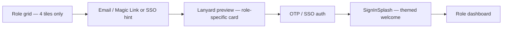

# NextSteps Metaverse UI/UX Specification

| Field | Value |
|-------|-------|
| **Document ID** | `metaverse-ui-ux-specification` |
| **Version** | 1.0.0-draft |
| **Status** | Draft — pending VP Product / Managing Director review |
| **NEXUS phase** | Discovery → Strategy |
| **Parent directive** | ALSAA-1 |
| **Issue** | ALSAA-9 |
| **Authored by** | Creative Director (Local Lab) |
| **Platform spec input** | `docs/nextsteps-maverick-platform-spec.md` §5 |
| **Architecture input** | `docs/architecture/legacy-audit-and-target-architecture.md` |
| **Legacy reference** | `src/theme/brandPalette.js`, `src/index.css`, `src/components/lanyard/` |
| **Target stack** | React + Tailwind CSS + R3F + Framer Motion + GSAP |

---

## Document map

1. [Creative vision](#1-creative-vision)
2. [60-30-10 color system](#2-60-30-10-color-system)
3. [Typography & iconography](#3-typography--iconography)
4. [Layout shell & navigation](#4-layout-shell--navigation)
5. [Lanyard identity system](#5-lanyard-identity-system)
6. [Motion, 3D & parallax](#6-motion-3d--parallax)
7. [Component library](#7-component-library)
8. [Role dashboards](#8-role-dashboards)
9. [Screen inventory & wireframe notes](#9-screen-inventory--wireframe-notes)
10. [Accessibility & inclusive visuals](#10-accessibility--inclusive-visuals)
11. [Tailwind migration tokens](#11-tailwind-migration-tokens)
12. [Engineering handoff checklist](#12-engineering-handoff-checklist)
13. [Acceptance criteria](#13-acceptance-criteria)

---

## 1. Creative vision

### 1.1 North star

NextSteps is not a corporate LMS with a gradient skin. It is a **mission world** — a whimsical, story-driven metaverse where every Maverick feels like they are progressing through a training adventure, not filling forms.

The Creative Director mandate: **one coherent visual language** across four role dashboards, anchored by the **60-30-10 rule**, the **R3F lanyard** as identity anchor, and **Magic Bento + Hyperspeed** as ambient delight — never decoration for decoration's sake.

### 1.2 Design principles

| Principle | Rule | Anti-pattern |
|-----------|------|--------------|
| **Mission, not admin** | Copy and layout frame tasks as missions, pulses, and command centres | "Submit form", sterile tables |
| **Accent discipline** | Amber (10%) reserved for XP, streaks, CTAs, alerts | Amber backgrounds, amber body text |
| **Aggregate privacy** | Trainer/L&D views never surface named surveillance | Per-Maverick live tracking UI |
| **Whimsy with purpose** | Motion celebrates completion, streaks, level-ups | Infinite particle noise on data tables |
| **Role clarity** | Each role has distinct dashboard personality within shared shell | Identical layouts with swapped labels |
| **Four roles only** | Maverick, Trainer, L&D Executive, Manager | Mentor, Supervisor, L&D Manager |

### 1.3 Role personality matrix

| Role | Dashboard codename | Tone | Dominant metaphor |
|------|-------------------|------|-------------------|
| **Maverick** | Mission HQ | Encouraging, gamified, personal | Space cadet on a training arc |
| **Trainer** | Session Deck | Operational, calm, responsive | Flight deck for live cohorts |
| **L&D Executive** | Ops Command Centre | Analytical, authoritative, panoramic | Mission control for all batches |
| **Manager** | My Mavericks | Professional, supportive, read-only passport | Deployment handoff & review |

---

## 2. 60-30-10 color system

### 2.1 Tier definitions

The 60-30-10 rule maps to **surface area**, not pixel count. When in doubt, remove chroma.

| Tier | Share | Purpose | Legacy tokens | Target usage |
|------|-------|---------|---------------|--------------|
| **60% — Dominant** | Backgrounds, page shells, sidebar base, table zebra, canvas clear | Neutral/metaverse base | `--base-bg`, `--base-card`, `--base-surface`, `--base-text` | Full viewport backgrounds; glass cards; sidebar gradient |
| **30% — Secondary** | Cards, nav active states, chart fills, tags, progress trails | Structural violet/blue family | `--brand-violet`, `--brand-blue`, `--secondary-lavender`, `--gradient-sidebar` | Sidebar active item, card borders, chart primary series, tag backgrounds |
| **10% — Accent** | CTAs, XP bars, streak flame, level-up, confusion alerts, badge rarity | Amber highlight | `--brand-amber`, `--accent-amber` | Primary buttons, XP fill, streak icon, alert badges only |

### 2.2 Canonical brand triad

Preserved from `brandPalette.js` — **do not introduce additional chromatic hues** without Creative Director approval.

| Name | Hex | RGB | Usage |
|------|-----|-----|-------|
| **Blue** | `#4361EE` | 67, 97, 238 | Links, info tags, chart secondary series, SSO badges |
| **Violet** | `#7B5CF5` | 123, 92, 245 | Primary brand, progress paths, nav accent, lanyard strap tint |
| **Amber** | `#F7C948` | 247, 201, 72 | XP, streaks, primary CTAs, warning highlights |

### 2.3 Light theme tokens

| Token | Value | Tier |
|-------|-------|------|
| `--base-bg` | `#f7f8fc` | 60% |
| `--base-card` | `rgba(255,255,255,0.82)` | 60% |
| `--base-surface` | `rgba(243,244,250,0.92)` | 60% |
| `--base-text` | `#1a1740` | 60% |
| `--base-text-secondary` | `#5c5780` | 60% |
| `--base-border` | `rgba(67,97,238,0.12)` | 60% |
| `--secondary-lavender` | `rgba(123,92,245,0.14)` | 30% |
| `--secondary-mint` | `rgba(67,97,238,0.12)` | 30% |
| `--gradient-sidebar` | `linear-gradient(180deg,#1e1b3a 0%,#121028 100%)` | 30% |
| `--gradient-primary` | `linear-gradient(135deg,#4361EE 0%,#7B5CF5 52%,#F7C948 100%)` | 30% (hero only) |
| `--brand-amber` | `#F7C948` | 10% |

### 2.4 Dark theme tokens

| Token | Value | Notes |
|-------|-------|-------|
| `--base-bg` | `#0c0a14` | Deep metaverse void |
| `--base-card` | `rgba(30,27,58,0.85)` | Glass card on dark |
| `--base-text` | `#e8e4ff` | High contrast body |
| `--base-text-secondary` | `#a09cc4` | Muted labels |
| `--base-border` | `rgba(123,92,245,0.18)` | Violet-tinted borders |
| Sidebar | Same `--gradient-sidebar` | Consistent across themes |

Dark mode Hyperspeed palette follows `hyperspeedEffectColors('dark')` in `brandPalette.js`.

### 2.5 60-30-10 audit checklist (per screen)

Before approving any screen, verify:

- [ ] Background + shell ≥ ~60% neutral (no more than subtle lavender wash)
- [ ] Structural violet/blue confined to cards, nav, charts, tags (~30%)
- [ ] Amber appears on ≤3 element types per viewport (CTA, XP/streak, alert)
- [ ] No fourth chromatic hue introduced
- [ ] WCAG 2.1 AA contrast on text pairs (see §10)

### 2.6 Semantic color mapping

| Semantic | Color | Never use for |
|----------|-------|---------------|
| Success / complete | Blue → Violet gradient | Error states |
| Warning / at-risk | Amber border + icon | Success toasts |
| Error / confusion spike | Rose tint from amber at 14% opacity + amber icon | Decorative backgrounds |
| Info | Blue tag | Primary CTA |
| XP / gamification | Amber fill on violet trail | Body copy |

---

## 3. Typography & iconography

### 3.1 Font stack

- **Primary:** Noto Sans (`--font-app`) — weights 400 (body), 600 (labels), 700 (headings), 800 (stat values)
- **Monospace:** `ui-monospace, 'Cascadia Code', monospace` — CodePen embed chrome, assessment IDs only

### 3.2 Type scale

| Level | Size | Weight | Usage |
|-------|------|--------|-------|
| Display | 28–32px | 800 | Dashboard H1, login title |
| Heading | 20–24px | 700 | Card titles, section headers |
| Body | 14–16px | 400 | Paragraphs, table cells |
| Label | 12–13px | 600 | Tags, form labels, stat labels |
| Stat | 20–28px | 800 | KPI numbers in stat cards |

### 3.3 Iconography

- **Library:** Lucide React (consistent stroke width 2)
- **Emoji in headings:** Permitted on Maverick/Trainer dashboards for whimsy; **avoid on Manager/L&D Executive** primary headings (use Lucide instead)
- **Stat card icons:** 22px inside 40px rounded square with tier-30% tint background

### 3.4 Avatars

- **Default:** DiceBear Personas, seeded by `userId` (deterministic)
- **Post-SSO optional:** Profile photo override; fallback to Personas
- **Sizes:** 32 (table), 40 (nav), 56 (passport preview), 80 (lanyard card)

---

## 4. Layout shell & navigation

### 4.1 App shell anatomy

```
┌─────────────────────────────────────────────────────────────┐
│ [Sidebar 260px]  │  [Main content — max-width fluid]        │
│ Logo + role badge│  Page header (H1 + subtitle)             │
│ Nav groups       │  Content grid (cards, charts, tables)    │
│ Theme toggle     │  Optional: Hyperspeed hero band (top)    │
│ User + logout    │                                          │
└─────────────────────────────────────────────────────────────┘
```

### 4.2 Sidebar specification

| Property | Value |
|----------|-------|
| Width | 260px fixed (collapsible to 72px icon rail on ≤1024px) |
| Background | `--gradient-sidebar` (30%) |
| Active item | Violet left border 3px + `rgba(123,92,245,0.2)` fill |
| Text | `#e8e4ff` primary, `#a09cc4` muted |
| Role badge | Top-right pill: role name + track/batch if Maverick |

### 4.3 Navigation groups by role

**Maverick — Mission HQ**

| Group | Items |
|-------|-------|
| Main | Dashboard, Passport, Skill Tree, Phase Timeline |
| Engage | Pulse Feedback, Deep Feedback, AI Buddy, Leaderboard |
| Grow | Stream Recommender |

**Trainer — Session Deck**

| Group | Items |
|-------|-------|
| Main | Dashboard |
| Sessions | Session Logger, Batch Pulse, Session Analytics |
| Assess | Assessments, Attendance |

**L&D Executive — Ops Command Centre**

| Group | Items |
|-------|-------|
| Main | Dashboard |
| Cohort | Batch Segregation |
| Intelligence | Curriculum Copilot, Effectiveness Loop, Batch Comparison |
| Reports | Report Generator |

**Manager — My Mavericks**

| Group | Items |
|-------|-------|
| Main | Dashboard (assigned Mavericks list) |
| Reviews | Per-Maverick review routes (`/review/:id`) |

**Removed entirely:** Mentor nav group, all `/mentor/*` routes.

### 4.4 Naming corrections (mandatory)

| Legacy | Target |
|--------|--------|
| L&D Manager | **L&D Executive** |
| Supervisor | **Manager** |
| `ld` role label in UI | L&D Executive |
| `supervisor` role key | `manager` |

### 4.5 Page header pattern

Every dashboard route opens with:

1. **H1** — role-appropriate codename + optional emoji (Maverick/Trainer only)
2. **Subtitle** — personalized greeting or scope statement (14px, `--base-text-secondary`)
3. **Optional action row** — primary CTA right-aligned (amber button)

Stagger animation: Framer Motion `staggerChildren: 0.08`, `y: 20 → 0`.

---

## 5. Lanyard identity system

### 5.1 Creative intent

The lanyard is the **physical metaphor for Maverick identity** — a credential you wear into the mission world. It appears at identity moments: login preview, passport, deployment transition, and Manager read-only passport preview (static card, not full physics).

### 5.2 Surfaces map

| Surface ID | Route / context | Roles | R3F physics | Card content |
|------------|-----------------|-------|-------------|--------------|
| `LANYARD-LOGIN-PREVIEW` | Login step after role select | All 4 | Yes — teaser | Role icon, "Next Steps", role name |
| `LANYARD-PASSPORT` | `/passport` | Maverick (edit), Manager (read-only via embed) | Yes — full | Photo, name, batch, track, XP, level, badges strip |
| `LANYARD-SPLASH` | Post-auth `SignInSplash` | All | Optional mini | Welcome message, streak/level if Maverick |
| `LANYARD-DEPLOYMENT` | SSO cutover modal | Maverick | Yes — re-render | Same card + **Deployed** badge (blue pill) |
| `LANYARD-MANAGER-EMBED` | Manager dashboard card | Manager | **No** — static 2D preview | XP, level, attendance, quiz avg |

### 5.3 Login flow with lanyard



**Login page layout (target):**

- Left 45%: Hyperspeed or parallax hero (WebGL)
- Right 55%: Magic Bento login card
- On role select: lanyard canvas fades in above card (300ms), card shows role-specific accent border (violet)

### 5.4 Lanyard component spec (R3F)

Based on legacy `Lanyard.jsx` — production hardening notes:

| Property | Desktop | Mobile (<768px) |
|----------|---------|-----------------|
| `fov` | 20 | 20 |
| `dpr` | [1, 2] | [1, 1.5] |
| Physics `timeStep` | 1/60 | 1/30 |
| `gravity` | [0, -40, 0] | [0, -40, 0] |
| Wrapper class | `lanyard-wrapper passport-lanyard-canvas` | Same, min-height 320px |

**Card texture fields (dynamic):**

- Full name
- Batch ID tag (violet)
- Track tag (blue)
- Level + XP strip (amber progress micro-bar)
- DiceBear avatar render target OR photo URL
- Badge icons row (max 5 visible + overflow)

**Assets:**

- `card.glb` — 3D card mesh (retain)
- `lanyard.png` — strap texture (retain; tint via material `#7B5CF5`)

### 5.5 Deployment badge

When Maverick transitions to SSO (`authMode=sso`):

- Banner: "You're deployed! Sign in with Hexaware SSO to continue your mission."
- Lanyard card gains blue `#4361EE` **Deployed** pill top-right
- XP, badges, history unchanged — visual only

### 5.6 Reduced motion fallback

When `prefers-reduced-motion: reduce`:

- Replace R3F canvas with static SVG credential card
- Same data fields, no physics, no drag interaction
- Hyperspeed disabled → solid `--gradient-hero` background

---

## 6. Motion, 3D & parallax

### 6.1 Motion token scale

| Token | Duration | Easing | Usage |
|-------|----------|--------|-------|
| `--transition-fast` | 150ms | `cubic-bezier(0.4,0,0.2,1)` | Hover, toggle |
| `--transition-base` | 250ms | same | Card expand, nav |
| `--transition-slow` | 400ms | same | Page enter |
| `--transition-spring` | 500ms | `cubic-bezier(0.34,1.56,0.64,1)` | XP bar fill, badge unlock |

### 6.2 Effect placement map

| Effect | Component | Surfaces | Reduced motion |
|--------|-----------|----------|----------------|
| **Hyperspeed** | `Hyperspeed.tsx` | Login hero, Maverick dashboard top band (optional) | Static gradient |
| **Magic Bento** | `AppMagicCard` / `MagicBento` | All card grids, login panel | Flat card, no spotlight |
| **R3F Lanyard** | `Lanyard.jsx` | Login, Passport, Deployment | Static SVG card |
| **Framer Motion** | Page wrappers | All routes — stagger reveal | Instant show |
| **GSAP particles** | Login `FloatingShapes` | Login background | Hidden |
| **Parallax scroll** | TBD Phase 2 | Phase Timeline, Skill Tree hero | Disabled |

### 6.3 Parallax roadmap (Phase 2 — post-MVP shell)

| Screen | Parallax layers | Story beat |
|--------|-----------------|------------|
| Phase Timeline | 3 layers (stars, station, foreground UI) | "Journey through training phases" |
| Skill Tree | 2 layers (nebula bg, tree foreground) | "Constellation of skills" |
| Leaderboard | 1 subtle layer | "Podium in space" |

MVP ships without parallax on inner routes; Hyperspeed + lanyard satisfy metaverse requirement for Strategy gate.

### 6.4 Celebration moments (Whimsy Injector approved)

| Event | Animation | Duration |
|-------|-----------|----------|
| Daily mission complete | Amber confetti burst (CSS) + toast | 1.2s |
| Level up | Circular progress pulse + haptic-style scale | 1.5s |
| Badge earned | Modal with badge zoom + violet glow | 2s |
| Pulse feedback submitted | Checkmark draw + XP +10 float | 800ms |

---

## 7. Component library

### 7.1 Core components

| Component | Legacy source | Target | Notes |
|-----------|---------------|--------|-------|
| `AppMagicCard` | `AppMagicCard.jsx` | Tailwind + Magic Bento spotlight | Base card for all dashboards |
| `StatCard` | Inline in dashboards | Extract | icon + value + label |
| `PageHeader` | Inline | Extract | H1 + subtitle + actions |
| `Tag` | `.tag`, `.tag-violet`, etc. | Tailwind variants | violet, blue, amber, green |
| `XPBar` | `.xp-bar`, `.xp-bar-fill` | Component | amber fill, violet trail |
| `PersonAvatar` | `PersonAvatar.jsx` | Keep | DiceBear |
| `ThemeToggle` | `ThemeToggle.jsx` | Keep | Light/dark |
| `SignInSplash` | `SignInSplash.jsx` | Refactor | Tie to real session |
| `Lanyard` | `Lanyard.jsx` | Extend | Dynamic card texture |
| `Hyperspeed` | `Hyperspeed.tsx` | Keep | Theme-aware colors |
| `Layout` | `Layout.jsx` | Refactor | 4-role nav only |

### 7.2 Button hierarchy

| Variant | Background | Text | Usage |
|---------|------------|------|-------|
| Primary | `--brand-amber` | `#1a1740` | Main CTA — max 1 per viewport |
| Secondary | `--secondary-lavender` | `--brand-violet` | Secondary actions |
| Ghost | transparent | `--brand-blue` | Tertiary, table actions |
| Danger | amber border | `--brand-amber` | At-risk acknowledge only |

### 7.3 Form patterns

- Inputs: 12px radius, `--base-border` focus ring violet 2px
- OTP/Magic link: 6-digit segmented input, auto-advance
- Feedback sliders: clarity/pace 1–5 with emoji anchors on Maverick pulse form

### 7.4 Chart styling (Recharts)

| Chart type | Primary fill | Secondary fill |
|------------|--------------|----------------|
| Bar | `#7B5CF5` | `#4361EE` |
| Line | `#4361EE` stroke 2px | — |
| Tooltip | 12px radius, `--shadow-md`, no border | — |
| Grid | `#E8E4DF` light / `rgba(123,92,245,0.1)` dark | dashed |

### 7.5 Data table

- Zebra: `--base-surface` alternating
- Row hover: `--secondary-lavender` 8% opacity
- No amber in table body except at-risk icon column

---

## 8. Role dashboards

### 8.1 Maverick — Mission HQ (`/`)

**Purpose:** Daily home base — XP progress, missions, upcoming session, quick links.

**Layout zones (top → bottom):**

| Zone | Content | 60-30-10 |
|------|---------|----------|
| Header | "Dashboard 🚀" + streak counter (amber flame) | 60% text, 10% streak |
| XP hero card | Circular progress Lv, XP bar, level title tag | 30% violet path, 10% amber fill |
| Stat grid (4-col) | Readiness, Badges, Streak, Next session | 30% icon tints |
| Daily missions | Checklist with toggle → XP toast | 10% on complete |
| Quick links grid | Passport, Skill Tree, Feedback, AI Buddy | 30% card borders |
| Upcoming session card | Meet link, time, trainer | 30% violet accent |

**Key interactions:**

- Toggle mission → optimistic UI → API credit XP
- XP bar animates on load (1.5s easeOut)
- Streak flame pulses subtly (CSS, disabled reduced-motion)

### 8.2 Trainer — Session Deck (`/`)

**Purpose:** Operational overview — batch health, session tools, at-risk count.

**Layout zones:**

| Zone | Content |
|------|---------|
| Header | "Trainer Dashboard" + specialization subtitle |
| Quick actions (3-col) | Session Logger, Batch Pulse, Session Analytics |
| Stat grid (4-col) | Mavericks in batch, Sessions delivered, Avg clarity, At-risk count |
| Clarity chart | Bar chart — session clarity/pace/feedback completion |
| At-risk list | Aggregate only — initials or bucketed if n<5 |
| Recent sessions table | Status, mood distribution mini-bar |

**Privacy rule:** At-risk list shows count + aggregate patterns; names only when cohort ≥5 and policy allows — default to anonymized buckets.

### 8.3 L&D Executive — Ops Command Centre (`/`)

**Purpose:** Panoramic batch health, AI insights entry points, executive KPIs.

**Layout zones:**

| Zone | Content |
|------|---------|
| Header | "L&D Command Centre" — **no emoji** |
| Stat grid (4-col) | Total Mavericks, Active batches, Avg feedback %, At-risk |
| Batch health chart | Grouped bar — readiness + feedback % by batch |
| AI insights panel | Curriculum copilot teaser, segregation pending count |
| Batch table | Phase, health badge, trainer, readiness, feedback % |
| Quick links | Segregation, Effectiveness, Reports |

**Tone:** More data-dense than Trainer; charts use violet/blue only — amber strictly for at-risk KPI.

### 8.4 Manager — My Mavericks (`/`)

**Purpose:** Post-deployment oversight — assigned Mavericks, passport preview, review entry.

**Layout zones:**

| Zone | Content |
|------|---------|
| Header | "My Mavericks" — professional tone |
| Maverick cards (stack) | Avatar, name, batch/track tags, passport preview strip |
| Passport preview | 2D stat strip: XP, Level, Attendance, Quiz avg |
| Actions | Submit Review (primary amber), View Passport (secondary) |
| Review status | Last review date, rating circular progress |

**No gamification chrome** on Manager dashboard — no streak flames, no mission language.

### 8.5 Dashboard comparison matrix

| Element | Maverick | Trainer | L&D Exec | Manager |
|---------|:--------:|:-------:|:--------:|:-------:|
| XP bar | ✓ | — | — | — |
| Hyperspeed band | optional | — | — | — |
| Recharts | — | ✓ | ✓ | mini only |
| Lanyard | link to Passport | — | — | 2D preview |
| Emoji in H1 | ✓ | ✓ | — | — |
| Magic Bento cards | ✓ | ✓ | ✓ | ✓ |
| Amber CTAs | ✓ | — | — | ✓ (review) |

---

## 9. Screen inventory & wireframe notes

### 9.1 Login & auth screens

| ID | Screen | Key elements |
|----|--------|--------------|
| AUTH-01 | Login — role select | 4 role tiles (2×2 grid), Magic Bento card, Hyperspeed bg |
| AUTH-02 | Login — email | Role-specific email hint, Magic Link CTA |
| AUTH-03 | Login — OTP | 6-digit input, lanyard preview visible |
| AUTH-04 | SignInSplash | Welcome animation, role redirect |
| AUTH-05 | SSO transition | Banner + lanyard deployment badge |

### 9.2 Maverick screens (9)

| Route | Screen ID | Hero element |
|-------|-----------|--------------|
| `/` | MAV-DASH | XP card |
| `/passport` | MAV-PASS | Full lanyard + credential strip |
| `/pulse-feedback` | MAV-PULSE | Mood emoji slider |
| `/deep-feedback` | MAV-DEEP | Phase gate form |
| `/skill-tree` | MAV-SKILL | Tree visualization (Phase 2 parallax) |
| `/stream-recommender` | MAV-STREAM | AI recommendation cards |
| `/ai-buddy` | MAV-BUDDY | Chat interface |
| `/leaderboard` | MAV-LEAD | Ranked list + batch filter |
| `/phase-timeline` | MAV-PHASE | Vertical timeline |

### 9.3 Trainer screens (6)

| Route | Screen ID |
|-------|-----------|
| `/` | TRN-DASH |
| `/session-logger` | TRN-LOG |
| `/batch-pulse` | TRN-PULSE |
| `/session-analytics` | TRN-ANALYTICS |
| `/assessments` | TRN-ASSESS |
| `/attendance` | TRN-ATTEND |

### 9.4 L&D Executive screens (6)

| Route | Screen ID |
|-------|-----------|
| `/` | LD-DASH |
| `/batch-segregation` | LD-SEG |
| `/curriculum-copilot` | LD-COPILOT |
| `/effectiveness` | LD-EFFECT |
| `/batch-comparison` | LD-COMPARE |
| `/reports` | LD-REPORTS |

### 9.5 Manager screens (2)

| Route | Screen ID |
|-------|-----------|
| `/` | MGR-DASH |
| `/review/:maverickId` | MGR-REVIEW |

---

## 10. Accessibility & inclusive visuals

### 10.1 WCAG 2.1 AA requirements

| Pair | Ratio target |
|------|--------------|
| `--base-text` on `--base-bg` | ≥ 4.5:1 |
| `--base-text-secondary` on `--base-bg` | ≥ 4.5:1 |
| White on `--gradient-sidebar` | ≥ 4.5:1 |
| `#1a1740` on `--brand-amber` (primary button) | ≥ 4.5:1 |

### 10.2 Keyboard & focus

- Login role grid: arrow key navigation, Enter to select
- Sidebar: Tab order logical; skip link to main content
- Focus ring: 2px violet offset, visible on all interactive elements

### 10.3 Reduced motion

`@media (prefers-reduced-motion: reduce)` disables:

- Hyperspeed WebGL
- R3F lanyard physics (static SVG fallback)
- GSAP FloatingShapes
- Framer stagger (instant)
- XP bar animation (instant fill)
- Celebration confetti

### 10.4 Inclusive visuals (Inclusive Visuals Specialist)

- Emoji mood selectors paired with text labels
- Color never sole indicator — icons + labels for status
- DiceBear avatars diverse by seed; avoid culture-specific emoji in L&D/Manager UI
- Chart patterns: optional hatch overlay for colorblind mode (Phase 2)

---

## 11. Tailwind migration tokens

Target: migrate from `index.css` custom properties to Tailwind v4 `@theme` extension.

### 11.1 Proposed `tailwind.config` theme extension

```javascript
// tailwind.config.js — excerpt for engineering handoff
theme: {
  extend: {
    colors: {
      brand: {
        blue: '#4361EE',
        violet: '#7B5CF5',
        amber: '#F7C948',
      },
      base: {
        bg: 'var(--base-bg)',
        card: 'var(--base-card)',
        text: 'var(--base-text)',
        muted: 'var(--base-text-secondary)',
        border: 'var(--base-border)',
      },
    },
    fontFamily: {
      app: ['Noto Sans', 'ui-sans-serif', 'system-ui', 'sans-serif'],
    },
    borderRadius: {
      sm: '8px',
      md: '12px',
      lg: '16px',
      xl: '24px',
    },
    boxShadow: {
      card: '0 8px 24px rgba(67, 97, 238, 0.08)',
      glow: '0 0 24px rgba(123, 92, 245, 0.18)',
    },
  },
},
```

### 11.2 Migration phasing

| Phase | Scope |
|-------|-------|
| 1 | Design tokens + Layout shell + Login |
| 2 | Four dashboards + shared components |
| 3 | Inner routes per role |
| 4 | Remove legacy CSS classes |

---

## 12. Engineering handoff checklist

Deliverables for VP Engineering implementation slice:

- [ ] This specification approved by VP Product
- [ ] `brandPalette.js` → Tailwind theme + CSS variables bridge
- [ ] `Lanyard.jsx` — dynamic card texture API (`user` prop)
- [ ] Login — 4 roles only; lanyard preview on role select
- [ ] Remove Mentor from `LoginPage`, `Layout`, `App.jsx`
- [ ] Rename Supervisor → Manager, L&D Manager → L&D Executive in all copy
- [ ] Four dashboard shells matching §8 layouts
- [ ] `prefers-reduced-motion` fallbacks wired
- [ ] Recharts theme uses `BRAND_HEX` only
- [ ] Storybook or route-level visual QA checklist (optional Phase 2)

### 12.1 Delegated design tasks (child issues recommended)

| Task | Owner | Priority |
|------|-------|----------|
| Figma / high-fidelity mockups — 4 dashboards | UI Designer | High |
| Lanyard card texture template (GLB + dynamic canvas) | Image Prompt Engineer | High |
| Marketing hero screenshots (login + Maverick passport) | Visual Storyteller | Medium |
| Parallax Phase Timeline concept | UX Architect | Low (Phase 2) |
| Brand guidelines PDF export | Brand Guardian | Medium |

---

## 13. Acceptance criteria

Aligned to ALSAA-1 plan revision and platform spec §5 integration slot.

| # | Criterion | Status |
|---|-----------|--------|
| AC-1 | 60-30-10 color system documented with light/dark tokens and audit checklist | ✓ |
| AC-2 | Canonical triad preserved (blue, violet, amber) — no extra chromatic hues | ✓ |
| AC-3 | Lanyard surfaces mapped (login, passport, deployment, manager preview) | ✓ |
| AC-4 | R3F lanyard production spec (responsive, reduced-motion fallback) | ✓ |
| AC-5 | Four role dashboards specified with layout zones and personality matrix | ✓ |
| AC-6 | Mentor removed from all design references | ✓ |
| AC-7 | Role naming corrected (L&D Executive, Manager) | ✓ |
| AC-8 | Motion/3D placement map with reduced-motion policy | ✓ |
| AC-9 | Component library inventory with Tailwind migration path | ✓ |
| AC-10 | Screen inventory with route IDs for requirements-to-design AI | ✓ |
| AC-11 | WCAG 2.1 AA contrast and keyboard requirements | ✓ |
| AC-12 | Engineering handoff checklist and delegated task table | ✓ |

---

## Appendix A — Glossary

| Term | Definition |
|------|------------|
| 60-30-10 | Color distribution rule: 60% neutral base, 30% structural brand, 10% accent |
| Magic Bento | GSAP spotlight card hover effect |
| Hyperspeed | WebGL tunnel background effect |
| Passport | Maverick training credential view |
| Mission HQ | Maverick dashboard codename |

---

## Appendix B — Revision history

| Version | Date | Author | Changes |
|---------|------|--------|---------|
| 1.0.0-draft | 2026-05-29 | Creative Director (ALSAA-9) | Initial metaverse UI/UX specification |

---

*End of specification.*
