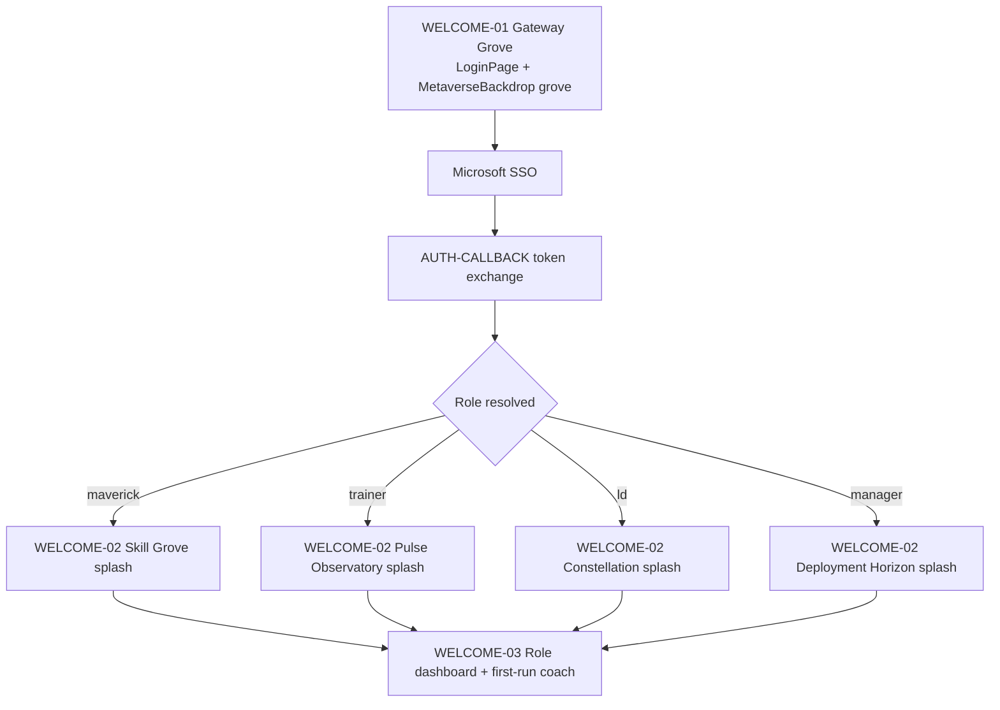

# Metaverse Welcome Experience — Implementation Spec

| Field | Value |
|-------|-------|
| **Document ID** | `metaverse-welcome-experience-spec` |
| **Version** | 1.0.0 |
| **Status** | Approved for engineering handoff |
| **Issue** | [ALSAA-56](/ALSAA/issues/ALSAA-56) |
| **Parent** | [ALSAA-54](/ALSAA/issues/ALSAA-54) |
| **Theme source** | `nextsteps-app/src/theme/maverickNebula.js` |
| **Platform UI spec** | `docs/design/metaverse-ui-ux-specification.md` |
| **Authored by** | Creative Director (Local Lab) |

---

## 1. Creative north star

**The Maverick Nebula** is the story wrapper for every first touch with NextSteps. Users do not "log into an LMS" — they **cross the Gateway Grove**, receive their **lanyard credential**, **hyperspeed into their role world**, and land in a dashboard that speaks their mission language.

**Feeling target:** *"The platform knew who I am, welcomed me into a world, and showed me where to go next."*

**Hard constraints**

- Four roles only: Maverick, Trainer, L&D Executive, Manager — **no Mentor** anywhere in copy, routes, or visuals.
- 60-30-10 color discipline on every welcome surface (see §4).
- Unified Microsoft SSO (see [ALSAA-51](/ALSAA/issues/ALSAA-51)); role is resolved server-side from designation/email — **no role picker on login**.

---

## 2. Story world — Maverick Nebula chapters

Canonical narrative from `NEBULA_STORY` in `maverickNebula.js`:

| Story zone | Codename | Chapter line (UI copy) | 3D backdrop (`ROLE_SCENE`) |
|------------|----------|------------------------|----------------------------|
| **Gateway** | Gateway Grove | "You stand at the Gateway Grove — choose your path through the Nebula." | `grove` |
| **Maverick** | Skill Grove / Mission HQ | "Your Skill Grove grows with every session, badge, and pulse of feedback." | `grove` |
| **Trainer** | Pulse Observatory / Session Deck | "From the Pulse Observatory you guide batches through the training skyline." | `city` |
| **L&D Executive** | Constellation Archive / Ops Command | "The Constellation Archive holds every batch, skill strand, and curriculum star." | `city` |
| **Manager** | Deployment Horizon / My Mavericks | "The Deployment Horizon shows Mavericks ready for the real-world orbit." | `horizon` |

**Tagline** (login card eyebrow): *"Where every journey leaves a luminous trail"*

---

## 3. Welcome journey — story beats & flow

### 3.1 End-to-end flow (current + target)



### 3.2 Beat specification

| Beat ID | Surface | Trigger | Visual | Copy | Motion | Duration |
|---------|---------|---------|--------|------|--------|----------|
| **WELCOME-01** | `/login` | Unauthenticated visit | `MetaverseBackdrop variant=grove` + `LoginLanyardTeaser` + Magic Bento card | Title: *The Maverick Nebula* · Chapter: Gateway Grove · CTA: *Sign in with Microsoft* | Lanyard physics teaser; card `y:24→0` 550ms; backdrop auto-rotate 0.35 | Until user acts |
| **WELCOME-02** | Full-viewport overlay | Post-auth, pre-dashboard (`SignInSplash`) | Hyperspeed tunnel + role-tinted overlay (target) | Role chapter line + personalized *Welcome, {firstName}* + role badge pill | Hyperspeed interactive; skip on Escape or CTA | 2.8–3.2s default; skippable |
| **WELCOME-03** | Role home `/` | Splash dismissed | `MetaverseBackdrop` per `ROLE_SCENE[role]` optional hero band OR static shell | Dashboard H1 + subtitle from role personality matrix | Framer stagger children 0.08s | Instant after splash |
| **WELCOME-04** | First-run coach (target) | `firstRun.{role}` local flag unset | Non-blocking bottom sheet or spotlight on primary nav item | One sentence mission brief per role | Spotlight pulse once; dismiss persists flag | User-controlled |

**Current implementation gaps (engineering backlog)**

| Gap | Current | Target per this spec |
|-----|---------|----------------------|
| Splash role awareness | Generic Hyperspeed + "Welcome, {name}" | Pass `user.role` → role chapter copy + backdrop tint + badge pill |
| Splash backdrop | Hyperspeed only | Optional `MetaverseBackdrop` under Hyperspeed at 40% opacity for role scene |
| First-run coach | Not implemented | `localStorage` key `ns.welcome.v1.{userId}.{role}` — see §5 |
| Login lanyard card | Static "Maverick Nebula" on fallback | Post-SSO preview only; login stays generic credential teaser |

### 3.3 Role routing matrix

Role resolution is **server-side** after Azure SSO. UI must never contradict assigned role.

| Resolved role | Route key | Dashboard codename | Splash chapter key | Scene variant | Primary CTA on first-run |
|---------------|-----------|-------------------|-------------------|---------------|--------------------------|
| Maverick | `maverick` | Mission HQ | `NEBULA_STORY.chapters.maverick` | `grove` | Open Passport / complete first pulse |
| Trainer | `trainer` | Session Deck | `NEBULA_STORY.chapters.trainer` | `city` | Open Session Logger |
| L&D Executive | `ld` | Ops Command Centre | `NEBULA_STORY.chapters.ld` | `city` | Review batch health table |
| Manager | `manager` | My Mavericks | `NEBULA_STORY.chapters.manager` | `horizon` | View assigned Maverick roster |

**App-admin role switch:** When `switchAppRole` is used, replay WELCOME-02 with new role chapter (reset `splashDone` only — do not replay WELCOME-04 unless role changed).

---

## 4. Theme tokens — 60-30-10 & four roles

### 4.1 Canonical color tokens (`NEBULA_COLORS`)

Source: `nextsteps-app/src/theme/maverickNebula.js`

| Tier | Token | Hex / value | Welcome usage |
|------|-------|-------------|---------------|
| **60%** | `base60` | `#0a0818` | Viewport void, splash overlay base, canvas clear |
| **60%** | `base60Card` | `rgba(12, 10, 28, 0.72)` | Login Bento card, splash text panel |
| **30%** | `secondary30` | `#4361ee` | SSO info border tint, Manager deployment pill |
| **30%** | `secondary30Violet` | `#7b5cf5` | Lanyard strap, active nav, progress trails |
| **10%** | `accent10` | `#f7c948` | Primary CTAs, tagline accent, streak/XP on Maverick splash |
| Ambient | `fog` | `#120f24` | Vignette gradient stops |
| Ambient | `glow` | `#7b5cf5` | Badge unlock glow, lanyard rim light |

**Bioluminescent palette** (`biolum` array): decorative particles in Grove scene only — never used for semantic status on welcome surfaces.

### 4.2 Role accent mapping (30% layer — strap & badge tint)

| Role | Strap tint | Badge border | Splash overlay gradient stop |
|------|------------|--------------|------------------------------|
| Maverick | `#7b5cf5` | violet 2px | `rgba(123,92,245,0.18)` |
| Trainer | `#4361ee` | blue 2px | `rgba(67,97,238,0.18)` |
| L&D Executive | `#7b5cf5` → `#4361ee` | dual gradient | `rgba(123,92,245,0.12)` |
| Manager | `#4361ee` | blue + violet pill | `rgba(67,97,238,0.14)` |

Amber (`accent10`) appears on **one** element per welcome viewport: primary button OR tagline — never both at full saturation on the same screen without Creative Director exception.

### 4.3 Typography on welcome surfaces

| Element | Size | Weight | Color |
|---------|------|--------|-------|
| Nebula title | 20px | 700 | `#e8e4ff` |
| Chapter line | 14px | 400 | `rgba(255,255,255,0.72)` |
| Tagline | 12px | 600 | `var(--brand-amber)` |
| Splash H2 | 28px | 800 | `#e8e4ff` |
| Splash hint | 12px | 400 | `rgba(255,255,255,0.55)` |

Font: Noto Sans (`--font-app`).

### 4.4 Motion tokens — welcome-specific

| Token | Value | Welcome surfaces |
|-------|-------|------------------|
| `--transition-welcome-enter` | 550ms `cubic-bezier(0.4,0,0.2,1)` | Login card enter |
| `--transition-lanyard-fade` | 450ms delay 150ms | Lanyard teaser |
| `--transition-splash-default` | 3200ms auto-dismiss | SignInSplash |
| `--transition-splash-skip` | 150ms fade out | Escape / Enter workspace |
| `--transition-dashboard-stagger` | 80ms per child | Post-splash dashboard |
| `--transition-spring-xp` | 500ms spring | First-run coach highlight only |

**Reduced motion (`prefers-reduced-motion: reduce`)**

- Login: `StaticLanyardFallback` (already implemented)
- Splash: static gradient hero, no Hyperspeed, instant dismiss option prominent
- First-run coach: text-only banner, no spotlight animation

---

## 5. First-run states

### 5.1 State model

| State key | Storage | Set when | Cleared when |
|-----------|---------|----------|--------------|
| `ns.welcome.v1.{userId}.{role}` | `localStorage` | User dismisses WELCOME-04 coach | Never (per role) |
| `ns.splash.skipHint.v1` | `localStorage` | User skips splash twice | Never |
| Session `splashDone` | React state | Splash completes | Logout |

### 5.2 Per-role first-run coach copy

| Role | Coach title | Body | Spotlight target |
|------|-------------|------|------------------|
| Maverick | Welcome to Mission HQ | "Your Passport is your Nebula credential. Complete today's pulse to grow your Skill Grove." | Nav: Passport |
| Trainer | Welcome to Session Deck | "Log your next session from the Logger — batch pulse updates in real time." | Nav: Session Logger |
| L&D Executive | Welcome to Ops Command | "Batch health and segregation queues live here. Start with the dashboard table." | Main batch table |
| Manager | Welcome to Deployment Horizon | "Your assigned Mavericks appear below. Open a passport preview before submitting a review." | First Maverick card |

**Returning users:** Skip WELCOME-04 when storage flag set. Always show WELCOME-02 on new session (unless user enabled "Skip welcome animation" in settings — Phase 2).

### 5.3 Error & edge states

| Condition | Welcome behavior |
|-----------|------------------|
| Role unresolved / unknown | Block dashboard; show Gateway Grove error card with support link — no splash |
| SSO cancelled | Return to WELCOME-01; preserve backdrop state |
| WebGL unavailable | Static lanyard + gradient background; copy unchanged |
| `isAppAdmin` demo switch | Replay splash with new role chapter; do not reset first-run flags for other roles |

---

## 6. Component contract (engineering)

### 6.1 Files to extend

| File | Change |
|------|--------|
| `SignInSplash.jsx` | Accept `role`, `chapterLine`; role-tinted overlay |
| `LoginPage.jsx` | No role picker; keep Gateway Grove + unified SSO |
| `LoginLanyardTeaser.jsx` | Already wired to `NEBULA_STORY` — no change |
| `MetaverseBackdrop.jsx` | Used on splash (optional) and dashboard hero bands |
| `maverickNebula.js` | Export `getWelcomeCopy(role)` helper (recommended) |
| New: `WelcomeCoach.jsx` | WELCOME-04 first-run spotlight |

### 6.2 Props API (proposed)

```javascript
// SignInSplash — target signature
SignInSplash({
  userName: string,
  role: 'maverick' | 'trainer' | 'ld' | 'manager',
  theme: 'light' | 'dark',
  chapterLine: string,  // default: NEBULA_STORY.chapters[role]
  onDone: () => void,
})

// WelcomeCoach — new
WelcomeCoach({
  userId: string,
  role: string,
  onDismiss: () => void,
})
```

---

## 7. Engineering handoff checklist — Software Architect pod

Use this checklist to gate [ALSAA-57](/ALSAA/issues/ALSAA-57) implementation orchestration.

### 7.1 Creative acceptance (this document)

- [x] Welcome journey beats WELCOME-01 through WELCOME-04 documented
- [x] Role routing matrix aligned to unified SSO (no Mentor, no role picker)
- [x] First-run state model with storage keys defined
- [x] Theme tokens exported from `maverickNebula.js` with 60-30-10 audit
- [x] Motion tokens + reduced-motion policy for all welcome surfaces

### 7.2 Implementation tasks (Architect pod)

| # | Task | Priority | Owner suggestion |
|---|------|----------|------------------|
| ENG-W1 | Extend `SignInSplash` with role-aware copy + tint | P0 | Frontend pod |
| ENG-W2 | Wire `MetaverseBackdrop` variant from `ROLE_SCENE[role]` on splash | P1 | R3F pod |
| ENG-W3 | Implement `WelcomeCoach` + `localStorage` first-run flags | P1 | Frontend pod |
| ENG-W4 | Add `getWelcomeCopy(role)` to `maverickNebula.js` | P2 | Frontend pod |
| ENG-W5 | Replay splash on `switchAppRole` without resetting unrelated first-run flags | P2 | Auth pod |
| ENG-W6 | 60-30-10 audit pass on login + splash viewports | P1 | QA / Design review |
| ENG-W7 | Verify no Mentor references in welcome copy or assets | P0 | All pods |

### 7.3 Cross-reference documents

| Document | Purpose |
|----------|---------|
| `docs/design/metaverse-ui-ux-specification.md` | Full platform UI system (dashboards, lanyard, a11y) |
| `docs/metaverse-ui-ux-spec.md` | Legacy consolidation reference |
| `nextsteps-app/src/theme/maverickNebula.js` | Runtime theme + story constants |

### 7.4 Definition of done (welcome slice)

1. New user completes SSO → role-specific splash chapter → lands on dashboard with first-run coach (once per role).
2. Reduced-motion path shows static credential + instant enter.
3. Creative Director 60-30-10 spot-check passes on login and splash screenshots.
4. [ALSAA-57](/ALSAA/issues/ALSAA-57) unblocked to orchestrate remaining ALSAA-54 feature surfaces.

---

## Appendix — Screen IDs for requirements traceability

| ID | Route / context |
|----|-----------------|
| WELCOME-01 | `/login` |
| WELCOME-02 | Post-auth splash overlay |
| WELCOME-03 | Role dashboard `/` |
| WELCOME-04 | First-run coach overlay |
| AUTH-CALLBACK | `/auth/callback` |

---

## Revision history

| Version | Date | Author | Changes |
|---------|------|--------|---------|
| 1.0.0 | 2026-05-31 | Creative Director | Initial implementation-ready welcome spec for ALSAA-56 |

*End of specification.*
