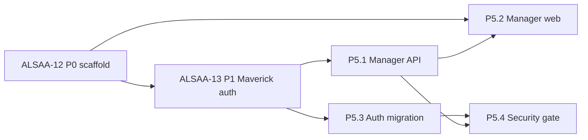

# P5 Engineering Assignment — Manager Reviews + Deployment Auth Migration

| Field | Value |
|-------|-------|
| **Parent issue** | ALSAA-17 |
| **Spec ref** | `docs/nextsteps-maverick-platform-spec.md` §7.6 P5, §2.8, §8 W-G01/W-G02/W-A01 |
| **Architecture ref** | `docs/architecture/legacy-audit-and-target-architecture.md` §7.5, §2.6 |
| **Author** | VP Engineering |
| **Date** | 2026-05-29 |
| **Sprint** | Lab AI Tools Sprint N |

---

## Scope summary

Deliver the Manager post-deployment vertical and Maverick auth-mode transition at deployment:

1. **Manager dashboard** — assigned Mavericks roster with early flags (W-G02 preview).
2. **Read-only Passport** — training history for assigned Mavericks (no edit).
3. **Structured periodic reviews** — CRUD on `manager_reviews` (W-G01).
4. **Deployment auth migration** — HRIS/deployment webhook flips `authMode` Gmail → SSO with zero profile loss (W-A01).

---

## Dependency graph

| Blocker | Impact | Mitigation |
|---------|--------|------------|
| **ALSAA-13 (P1) blocked** | Auth migration + live passport data blocked | Manager UI can scaffold against API contract + legacy mock fallback until P1 unblocks |
| **P0 scaffold in workspace** | Verify monorepo packages land in `nextsteps-web/api/worker` | Backend Architect confirms P0 artifact path before API implementation |

---

## Workstream assignments

### P5.1 — Manager API + data model (Backend Architect)

**Owner:** Backend Architect → Backend Developer IC  
**Package:** `nextsteps-api`  
**Estimate:** 8h

| Deliverable | Detail |
|-------------|--------|
| Mongo schema | `manager_reviews` collection per architecture §2.5 |
| RBAC | `manager` role only; assignment scoped to `managerId` |
| Routes | `GET /manager/dashboard`, `GET /manager/mavericks/:id/passport`, `GET/POST /manager/mavericks/:id/reviews`, `GET /manager/mavericks/:id/early-flags` |
| Tests | TDD — route integration tests with JWT fixtures |

**Acceptance:** Postman/contract tests pass; Manager cannot read unassigned Maverick passport (403).

---

### P5.2 — Manager web vertical (Software Architect)

**Owner:** Software Architect → Frontend Developer IC  
**Package:** `nextsteps-web`  
**Estimate:** 10h

| Deliverable | Detail |
|-------------|--------|
| Rename | `supervisor` → `manager` (routes, nav, copy, mock keys) |
| Screens | Manager dashboard, performance review form, read-only passport view |
| Legacy lift | Refactor `SupervisorDashboard.jsx` / `PerformanceReview.jsx` → API hooks |
| Design | Defer to `docs/design/metaverse-ui-ux-specification.md` Manager IA |

**Acceptance:** Manager SSO login → dashboard lists assigned Mavericks → submit review → passport read-only.

---

### P5.3 — Deployment auth migration (Backend Architect)

**Owner:** Backend Architect → Backend Developer IC  
**Package:** `nextsteps-api` + `nextsteps-worker`  
**Estimate:** 12h  
**Blocked by:** ALSAA-13 (P1 Maverick auth shell must exist)

| Deliverable | Detail |
|-------------|--------|
| Webhook | `POST /webhooks/deployment` (HMAC-signed stub until HRIS source confirmed) |
| Job | `auth-provider-migrate` — set `deploymentStatus=post`, link SSO identity, preserve `userId` |
| JWT | Flip `authMode` claim; force re-login banner payload |
| Continuity test | XP, badges, feedback, skill tree unchanged after migration |

**Acceptance:** Simulated deployment event → Maverick forced to SSO → same profile data on login.

---

### P5.4 — Auth migration security gate (Security Engineer)

**Owner:** Security Engineer  
**Estimate:** 4h  
**Blocked by:** P5.3 implementation PR

| Deliverable | Detail |
|-------------|--------|
| Threat model | Webhook spoofing, account linking takeover, token replay |
| Vigolium scan | NEXUS Hardening gate per `docs/nexus-hardening-gate.md` |
| Sign-off | Comment on parent ALSAA-17 when clean |

---

## QA handoff (QA Director)

| Test case | Scenario |
|-----------|----------|
| TC-P5-01 | Manager views assigned roster only |
| TC-P5-02 | Submit structured review (all categories rated) |
| TC-P5-03 | Read-only passport — no edit controls |
| TC-P5-04 | Deployment webhook → authMode flip → SSO login → profile intact |
| TC-P5-05 | Unassigned Maverick passport returns 403 |

---

## Exit criteria (ALSAA-17 done)

- [ ] All four child workstreams `done`
- [ ] P5 integration smoke on `dev` branch (feature → PR → merge per POU-79)
- [ ] Security Engineer sign-off on auth migration
- [ ] QA Director regression pack TC-P5-01–05 Ready

---

## Escalations

| Trigger | Escalate to |
|---------|-------------|
| P1 remains blocked > 24h | VP Engineering → unblock ALSAA-13 with CTO |
| HRIS webhook source unknown | VP Product → open question §7.5.2 |
| SSO test tenant unavailable | CTO → DevOps |
