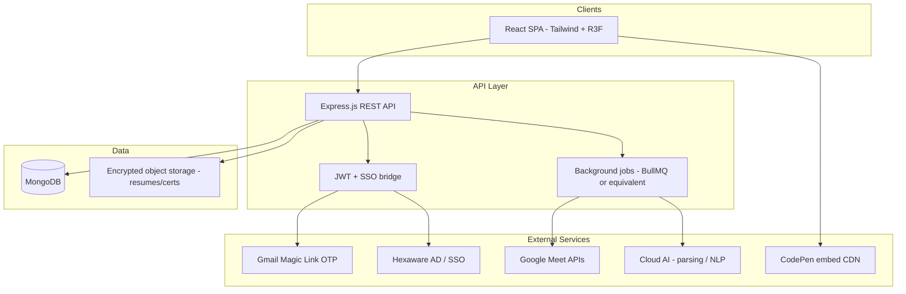
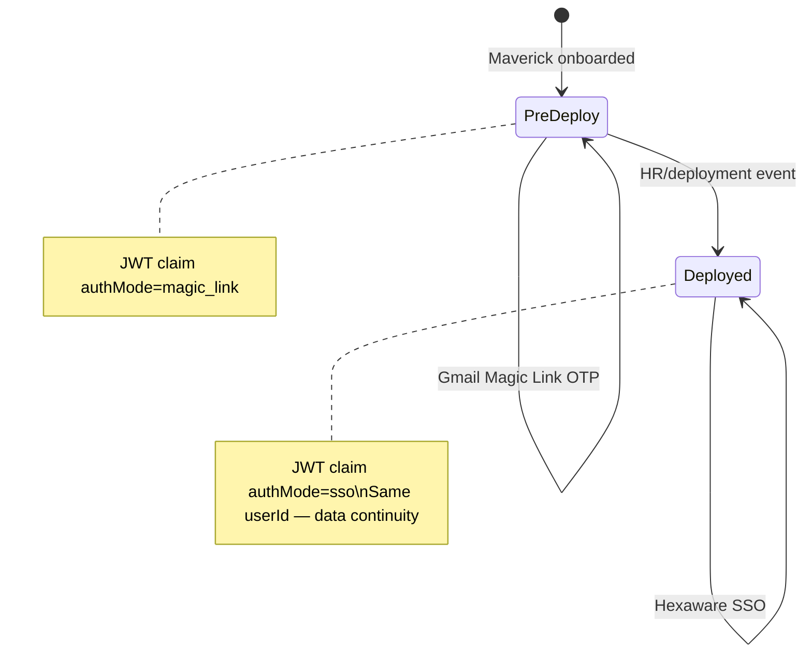

# NextSteps Maverick Experience Platform — System Specification

| Field | Value |
|-------|-------|
| **Document ID** | `nextsteps-maverick-platform-spec` |
| **Version** | 1.1.0-consolidated |
| **Status** | CEO approved — NEXUS Strategy gate open |
| **NEXUS phase** | Strategy complete → Build |
| **Strategy roadmap** | `docs/nextsteps-nexus-strategy-epic-roadmap.md` (ALSAA-10) |
| **Parent directive** | ALSAA-1 (plan revision `de3e5fa9`) |
| **Lead issue** | ALSAA-7 |
| **Authored by** | VP of Product |
| **Architecture input** | ALSAA-5 — merged (`docs/architecture/legacy-audit-and-target-architecture.md`) |
| **UI/UX input** | ALSAA-9 — companion spec (`docs/design/metaverse-ui-ux-specification.md`) |
| **Legacy reference** | `C:\Users\2000147951\Projects\NextSteps` (Vite + React prototype, v0.0.0) |
| **Target stack** | MERN + React Three Fiber + Tailwind CSS |

---

## Document map

1. [Vision & Context](#1-vision--context)
2. [High-Level Architecture](#2-high-level-architecture)
3. [User Roles](#3-user-roles)
4. [Major Functional Modules](#4-major-functional-modules)
5. [Design & UI/UX](#5-design--uiux)
6. [Privacy & Data Handling](#6-privacy--data-handling)
7. [Constraints & Expectations](#7-constraints--expectations)
8. [Role → Feature → Workflow Matrix](#8-role--feature--workflow-matrix)
9. [Legacy → Target Migration Notes](#9-legacy--target-migration-notes)

---

## 1. Vision & Context

### 1.1 Product vision

NextSteps is a **unified, cloud-native, metaverse-inspired platform** for Hexaware Mavericks (GET and PGET trainees). It spans the full lifecycle: training, onboarding, deployment, continuous feedback, and post-deployment performance tracking.

The experience is **whimsical and story-driven**, using the **60-30-10 color rule** (dominant base, secondary structure, accent highlights) so every screen feels like one coherent “mission” world—not a corporate form library.

### 1.2 Problem statement

Today, Maverick programs rely on fragmented tools (spreadsheets, ad-hoc surveys, separate LMS pieces, manual batch assignment). Trainers lack real-time batch pulse; L&D lacks AI-assisted segregation and effectiveness loops; Managers lack a single read-only training passport when Mavericks deploy.

NextSteps consolidates these journeys into one platform with **role-specific dashboards**, **gamified engagement**, and **privacy-centric aggregate analytics**.

### 1.3 Strategic outcomes

| Outcome | Success signal |
|---------|----------------|
| Higher Maverick engagement | ↑ session attendance, feedback completion, daily mission completion |
| Faster trainer response | Confusion alerts surfaced within one session cycle |
| Smarter batch design | AI segregation reduces manual grouping time by ≥50% |
| Continuity at deployment | Magic Link → SSO transition with zero profile data loss |
| Manager confidence | Structured reviews + early flags before performance issues escalate |

### 1.4 Technology principles

- **MERN** as the production stack (MongoDB, Express.js, React.js, Node.js).
- **Immersive UI**: React Three Fiber (R3F), Rapier physics, parallax scrolling, React Bits **lanyard** on login and identity surfaces.
- **Embedded learning**: CodePen (or equivalent live-render) embeds for assessments and code challenges.
- **Cloud AI**: Resume/certificate parsing, skill extraction, sentiment/confusion analysis, curriculum copilot.
- **Google Meet**: Transcript ingestion via Google APIs for session intelligence (aggregate only).

### 1.5 Scope boundaries (explicit)

| In scope | Out of scope |
|----------|--------------|
| Four roles: Maverick, Trainer, L&D Executive, Manager | **Mentor** role and all Mentor workflows (strictly omitted) |
| Pre- and post-deployment Maverick auth | Individual employee surveillance |
| Batch-level anonymized analytics | Live per-Maverick micromanagement dashboards for Trainers |
| Hexaware SSO for employees | Consumer social features |

---

## 2. High-Level Architecture

> **Consolidated (ALSAA-5):** Merged from CTO legacy audit and target architecture appendix (2026-05-29). Source appendix: `docs/architecture/legacy-audit-and-target-architecture.md`.

### 2.1 System context diagram

### 2.2 Layer responsibilities

| Layer | Responsibility |
|-------|----------------|
| **Frontend (React)** | Role-routed SPA; Tailwind; R3F scenes (lanyard, hyperspeed/parallax accents); CodePen embed host; optimistic UI for feedback |
| **API (Express)** | REST resources per domain; JWT issuance; RBAC middleware; webhook receivers (Meet, deployment events) |
| **Auth** | Dual path for Mavericks; SSO for all employees; role claims in JWT (`maverick`, `trainer`, `ld_executive`, `manager`) |
| **Data (MongoDB)** | Users, batches, sessions, feedback, XP ledger, skills, reviews, audit logs |
| **Jobs** | Transcript fetch, AI parsing, reminder emails, leaderboard recompute, confusion aggregation |
| **Storage** | AES-encrypted resumes/certificates; signed URLs with short TTL |

### 2.3 Legacy prototype vs target

| Dimension | Legacy (`NextSteps` prototype) | Target (revamp) |
|-----------|----------------------------------|-----------------|
| Runtime | Vite SPA only, `mockData.json` | Full MERN with API + MongoDB |
| Auth | Demo role picker + fake OTP | Magic Link + SSO with deployment flip |
| Roles | 5 roles incl. Mentor, Supervisor, L&D Manager | **4 roles**; renamed per §3 |
| 3D | R3F lanyard, Hyperspeed, Magic Bento | Retain; expand parallax on key story beats |
| Backend | None | Express + JWT + jobs |

### 2.4 Service boundaries (target monorepo)

| Package | Responsibility | Stack |
|---------|----------------|-------|
| `nextsteps-web` | React SPA, Tailwind migration, R3F shell | Vite, React 19, R3F |
| `nextsteps-api` | REST `/api/v1`, auth, RBAC, validation | Express, JWT, Zod/Joi |
| `nextsteps-worker` | Async pipelines | BullMQ + Redis |
| `nextsteps-infra` | IaC, secrets, CI/CD | Org cloud standard |

### 2.5 MongoDB collections (target)

| Collection | Purpose |
|------------|---------|
| `users` | All personas; auth provider refs |
| `maverick_profiles` | XP, skills, badges, stream, deployment state |
| `batches` | Lifecycle, trainer assignment, health |
| `sessions` | Training sessions, attendance, aggregates |
| `feedback_pulse` / `feedback_deep` | Session and phase feedback |
| `assessments` | Quizzes, CodePen embed refs, scores |
| `transcripts` | Meet raw + AI summary |
| `documents` | Resume/certificate metadata + storage keys |
| `manager_reviews` | Post-deploy performance reviews |
| `curriculum_insights` | L&D copilot recommendations |
| `audit_logs` | Sensitive field access |

### 2.6 Background jobs

| Job | Trigger | Output |
|-----|---------|--------|
| `parse-resume` | Document upload | Skill vector on profile |
| `segregate-batch` | L&D batch creation | Assignments + stream recommendations |
| `ingest-meet-transcript` | Post-session webhook | Transcript + confusion timestamps |
| `analyze-session-sentiment` | Transcript ready | Batch-aggregated mood/clarity |
| `send-feedback-reminder` | Cron / session end | Email nudges |
| `compute-leaderboard` | XP event | Denormalized leaderboard cache |
| `auth-provider-migrate` | Deployment event | Gmail → SSO link on same `userId` |

### 2.7 Core API surface (`/api/v1`)

Base path requires `Authorization: Bearer <JWT>` unless noted. Full route tables in architecture appendix §7.

| Prefix | Primary consumers | Notes |
|--------|-------------------|-------|
| `/auth` | All | Magic link, SSO, link-sso at deployment |
| `/maverick/*` | Maverick | Dashboard, passport, feedback, AI buddy, documents |
| `/trainer/*` | Trainer | Sessions, pulse aggregates, assessments, attendance |
| `/ld/*` | L&D Executive | Segregation, copilot, effectiveness, reports |
| `/manager/*` | Manager | Roster, passport read-only, reviews, early flags |

### 2.8 Authentication state machine (Maverick)

**Deployment transition requirements:**

- Single canonical `userId` across auth modes.
- Preserve XP, badges, feedback history, skill tree progress.
- Force re-login once on SSO cutover; banner explains the change.
- Lanyard identity card re-renders with deployment badge (visual only).

---

## 3. User Roles

Canonical role names **only** (no Mentor, Supervisor, or L&D Manager in product copy, APIs, or docs).

### 3.1 Maverick (trainee — GET / PGET)

| Attribute | Detail |
|-----------|--------|
| **Auth** | Pre-deployment: Gmail Magic Link OTP. Post-deployment: Hexaware SSO (same account record). |
| **Primary goal** | Complete training missions, give feedback, grow skills, prepare for deployment. |
| **Legacy mapping** | `maverick` role in prototype |

### 3.2 Trainer (internal employee / SME)

| Attribute | Detail |
|-----------|--------|
| **Auth** | Hexaware SSO only |
| **Primary goal** | Deliver sessions, monitor batch pulse, publish assessments, track attendance. |
| **Legacy mapping** | `trainer` role in prototype |

### 3.3 L&D Executive (curriculum owner)

| Attribute | Detail |
|-----------|--------|
| **Auth** | Hexaware SSO only |
| **Primary goal** | Own curriculum, batch design, effectiveness analytics, executive reporting. |
| **Legacy mapping** | `ld` role — **rename all UI/API from “L&D Manager” to “L&D Executive”** |

### 3.4 Manager (on-project manager, post-deployment)

| Attribute | Detail |
|-----------|--------|
| **Auth** | Hexaware SSO only |
| **Primary goal** | Monitor assigned Mavericks, read training passport, run structured reviews, early flags. |
| **Legacy mapping** | `supervisor` role — **rename to “Manager”**; routes `/supervisor/*` → `/manager/*` |

### 3.5 Omitted role: Mentor

The legacy prototype includes `mentor` (`MentorDashboard.jsx`, nav config, login tile). **The revamp omits Mentor entirely**—no routes, APIs, data models, emails, or analytics dimensions.

---

## 4. Major Functional Modules

### 4.1 Gamification

| Feature | Maverick | Trainer | L&D Executive | Manager |
|---------|:--------:|:-------:|:-------------:|:-------:|
| XP ledger (attendance, feedback, quizzes) | ✓ | — | read aggregate | read via passport |
| Badges & streaks | ✓ | — | — | — |
| Batch leaderboard | ✓ | view batch | view all batches | — |
| Daily missions | ✓ | — | — | — |
| Batch XP goals | view | configure | configure | — |

**Workflow — earn XP:** Session marked attended → job credits XP → dashboard animates → leaderboard updates nightly.

**Legacy screens:** `MaverickDashboard`, `Leaderboard`, `PhaseTimeline`, `SkillTree` (XP-adjacent).

### 4.2 Feedback 360°

| Feature | Maverick | Trainer | L&D Executive | Manager |
|---------|:--------:|:-------:|:-------------:|:-------:|
| Pulse feedback (post-session) | submit | batch aggregate | batch + cross-batch | — |
| Deep feedback (post-phase) | submit | aggregate themes | effectiveness linkage | — |
| Auto reminders | receive | — | configure cadence | — |

**Workflow — pulse:** Session ends → Maverick prompted → mood/clarity/pace + optional text → Trainer sees **batch-only** confusion heatmap (no named surveillance).

**Legacy screens:** `PulseFeedback`, `DeepFeedback`, `BatchPulseBoard`, `SessionAnalytics`.

### 4.3 AI resume/certificate parsing & batch segregation

| Feature | Maverick | Trainer | L&D Executive | Manager |
|---------|:--------:|:-------:|:-------------:|:-------:|
| Upload resume/certs | ✓ (onboarding) | — | ✓ manage | — |
| AI skill extraction | view own | summary only | ✓ full edit | — |
| Batch segregation proposals | — | — | ✓ approve/reject | — |
| Stream recommender | ✓ | — | override | — |

**Workflow — segregate:** L&D uploads cohort docs → AI proposes batches → executive adjusts → publishes assignments → Mavericks notified.

**Legacy screens:** `BatchSegregation`, `StreamRecommender`.

### 4.4 Session intelligence

| Feature | Maverick | Trainer | L&D Executive | Manager |
|---------|:--------:|:-------:|:-------------:|:-------:|
| Google Meet transcript ingest | — | — | ✓ configure | — |
| Sentiment / confusion (aggregate) | self-review tips | batch alerts | cross-batch trends | — |
| Session logger | — | ✓ CRUD | read | — |
| Attendance tracking | view own | ✓ | read | — |

**Privacy rule:** No live per-person surveillance UI; confusion is **batch-aggregated** with threshold alerts.

**Legacy screens:** `SessionLogger`, `AttendanceTracker`, `BatchPulseBoard`.

### 4.5 Training effectiveness

| Feature | Maverick | Trainer | L&D Executive | Manager |
|---------|:--------:|:-------:|:-------------:|:-------:|
| Effectiveness loop analytics | — | — | ✓ | — |
| Cross-batch comparison | — | — | ✓ | — |
| Executive reports | — | — | ✓ export | — |
| Manager performance reviews | — | — | read linkage | ✓ CRUD |
| Early performance flags | — | — | — | ✓ |

**Legacy screens:** `EffectivenessLoop`, `BatchComparison`, `ReportGenerator`, `PerformanceReview`, `SupervisorDashboard`.

### 4.6 Assessments & CodePen embeds

| Feature | Maverick | Trainer | L&D Executive | Manager |
|---------|:--------:|:-------:|:-------------:|:-------:|
| Publish assessment (embed URL) | take | ✓ | — | — |
| Completion tracking | view | ✓ | read | — |

**Workflow — assessment:** Trainer attaches CodePen embed + rubric → Mavericks submit in iframe sandbox → results roll into XP + Trainer analytics.

**Legacy screen:** `AssessmentPublisher`.

### 4.7 AI learning buddy & curriculum copilot

| Feature | Maverick | Trainer | L&D Executive | Manager |
|---------|:--------:|:-------:|:-------------:|:-------:|
| AI Buddy (Q&A) | ✓ | — | — | — |
| Curriculum copilot | — | — | ✓ | — |

**Guardrails:** Rate limits, no PII in prompts to third-party models, audit log of copilot sessions.

**Legacy screens:** `AIBuddy`, `CurriculumCopilot`.

### 4.8 Identity & lanyard experiences

| Surface | Roles | Behavior |
|---------|-------|----------|
| Login role preview | All (picker shows 4 roles only) | Role-specific lanyard teaser per ALSAA-1 |
| Maverick Passport | Maverick (edit), Manager (read-only) | Full-viewport R3F lanyard + credential strip |
| Sign-in splash | All post-auth | Themed welcome, preserves brand motion |

**Legacy components:** `Lanyard.jsx`, `MaverickPassport.jsx`, `SignInSplash.jsx`, `LoginPage.jsx`.

### 4.9 Authentication & system flows

See §2.8. Additional flows:

| Flow | Steps |
|------|-------|
| Employee login | SSO → role resolution → role dashboard |
| Maverick first login | Magic link → profile bootstrap → lanyard onboarding |
| Logout | Clear tokens; return to login with role memory optional off |

---

## 5. Design & UI/UX

> **Consolidated (ALSAA-9):** Companion metaverse UI spec at `docs/design/metaverse-ui-ux-specification.md` — authoritative for motion tokens, lanyard surfaces, parallax matrix, component IDs, and per-role dashboard IA. Section 5 below is the product-facing summary; engineering defers to the design doc for implementation tokens.

### 5.1 Brand system (60-30-10)

| Tier | Share | Legacy implementation | Target rule |
|------|-------|----------------------|-------------|
| **Dominant (60%)** | Backgrounds, shells | `--base-*` surfaces, dark purple sidebar | Neutral/metaverse base; light + dark themes |
| **Secondary (30%)** | Cards, nav, typography | Indigo/violet structure | Structural violet family |
| **Accent (10%)** | CTAs, XP, alerts | Amber highlights (`#F7C948`) | Sparingly—for XP, streaks, key CTAs |

**Canonical palette (from legacy `brandPalette.js`):**

- Blue `#4361EE`
- Violet `#7B5CF5`
- Amber `#F7C948`

### 5.2 Typography & avatars

- **Font:** Noto Sans globally (`--font-app`).
- **Avatars:** DiceBear Personas, seeded by Maverick ID (deterministic, portrait style).

### 5.3 Motion & 3D

| Pattern | Usage |
|---------|-------|
| R3F lanyard | Login identity, Maverick Passport |
| Hyperspeed / parallax | Hero backgrounds, mission transitions |
| Magic Bento (GSAP) | Card hover spotlight on dashboards, login panel |
| Framer Motion | Page transitions, micro-interactions |

### 5.4 Navigation pattern

- Left sidebar per role; sections grouped by workflow (Main, Feedback, Analytics, etc.).
- **No Mentor nav group.**
- Rename labels: “L&D Manager” → “L&D Executive”; “Supervisor” → “Manager”.

### 5.5 Key screens per role (target)

| Role | Dashboard | Notable routes |
|------|-----------|----------------|
| Maverick | Mission HQ | passport, skill-tree, phase-timeline, pulse/deep feedback, stream-recommender, ai-buddy, leaderboard |
| Trainer | Trainer home | session-logger, batch-pulse, session-analytics, assessments, attendance |
| L&D Executive | Ops command centre | batch-segregation, curriculum-copilot, effectiveness, batch-comparison, reports |
| Manager | My Mavericks | performance review per assignee |

### 5.6 Accessibility

- WCAG 2.1 AA contrast on 60-30-10 pairs.
- Keyboard nav for sidebar and login role grid.
- Reduced-motion media query disables GSAP particles and non-essential R3F physics.

---

## 6. Privacy & Data Handling

### 6.1 Encryption & storage

| Data class | At rest | In transit |
|------------|---------|------------|
| Resumes, certificates | AES-256 / SSE-KMS in object storage | TLS 1.2+ |
| Feedback open text | MongoDB field-level encryption or encrypted subdocument | TLS |
| Transcripts | Encrypted blob + redacted summary in Mongo | TLS |
| PII (email, phone) | Encrypted or tokenized in `users` | TLS |

- Signed download URLs: ≤15 minute TTL, role-checked.
- **Audit:** Log all access to `documents`, full skill profiles, and transcript raw text (ALSAA-5 §6.4).

### 6.2 Access control matrix

| Data class | Maverick | Trainer | L&D Executive | Manager |
|------------|:--------:|:-------:|:-------------:|:-------:|
| Own full skill profile | read/write | — | — | — |
| Other Maverick skills | — | summary | read/write all | summary via passport |
| Own feedback | read/write | — | aggregate | — |
| Batch feedback analytics | — | aggregate | aggregate | — |
| Assigned Maverick passport | — | — | — | read-only |
| Performance reviews | — | — | read linkage | read/write own reports |

### 6.3 Anonymization rules

- Trainer confusion views: **no Maverick names** below cohort size n≥5; otherwise bucketed.
- L&D cross-batch charts: k-anonymity threshold configurable (default k=5).
- Manager flags: named (assigned relationship) but **no transcript-level surveillance**.

### 6.4 Retention

- Feedback: retain per HR policy (default 24 months).
- Meet transcripts: processed → summary stored; raw transcript purge at 90 days unless legal hold.
- AI copilot logs: 30 days, PII scrubbed.

### 6.5 Compliance posture (2025)

- No keystroke/session recording.
- Aggregate analytics only for training quality—not performance surveillance of individuals by Trainers.

---

## 7. Constraints & Expectations

### 7.1 Hard constraints

1. **Mentor omitted** everywhere (UI, API, DB, email templates, analytics).
2. **Role names only:** Maverick, Trainer, L&D Executive, Manager.
3. **MERN stack** for production; R3F, lanyard, CodePen embeds, parallax/physics as specified.
4. **Dual Maverick auth** with seamless deployment transition.
5. Output consumable by **requirements-to-design AI** — explicit IDs, tables, workflows.

### 7.2 Non-functional targets (draft)

| NFR | Target |
|-----|--------|
| API p95 latency | < 300ms reads, < 800ms writes |
| SPA LCP | < 2.5s on corp network |
| Uptime | 99.5% business hours |
| Concurrent Mavericks per batch | 50 |

### 7.3 Delivery phases (NEXUS Strategy gate)

| Phase | Deliverable |
|-------|-------------|
| Discovery ✓ | This specification |
| Strategy ✓ | `docs/nextsteps-nexus-strategy-epic-roadmap.md` — ADO ladder on ALSAA-11 |
| Build | MERN scaffold + auth + first role vertical slice |
| Harden | Privacy audit, SSO cutover playbook, load test |

### 7.4 Discovery workstream status (ALSAA-1 plan `de3e5fa9`)

| Issue | Owner | Status | Work product |
|-------|-------|--------|--------------|
| ALSAA-5 | CTO | ✓ Complete | `docs/architecture/legacy-audit-and-target-architecture.md` |
| ALSAA-9 | Creative Director | ✓ Complete | `docs/design/metaverse-ui-ux-specification.md` |
| ALSAA-7 | VP of Product | ✓ Complete (this doc v1.1.0) | `docs/nextsteps-maverick-platform-spec.md` |

### 7.5 Open questions (CEO / HR / DevOps)

1. Hexaware SSO protocol (OIDC vs SAML) and test tenant availability.
2. HRIS source for Deployment Day 0 auth migration webhook.
3. Google Meet Workspace domain, OAuth scopes, recording retention.
4. Approved cloud LLM provider for Hexaware.
5. Hosting alignment (Azure vs AWS) and CI pipeline on `dev`.
6. Tailwind migration strategy — big-bang vs incremental alongside legacy CSS.

### 7.6 Recommended build phasing (post-CEO approval)

| Phase | Scope |
|-------|-------|
| **P0** | Monorepo scaffold: `web` + `api` + `worker`, MongoDB, JWT auth shell, SSO stub |
| **P1** | Maverick pre-deploy auth + dashboard + passport |
| **P2** | Trainer session logger + pulse feedback pipeline |
| **P3** | L&D batch + document upload + parse jobs |
| **P4** | Meet transcript + sentiment jobs |
| **P5** | Manager reviews + deployment auth migration |
| **P6** | Gamification leaderboard cache + badge rules |

---

## 8. Role → Feature → Workflow Matrix

| Workflow ID | Role | Feature / screen | Trigger | System actions | Done when |
|-------------|------|------------------|---------|----------------|-----------|
| W-M01 | Maverick | Daily missions | Login | Load missions, award XP on complete | All missions done or expired |
| W-M02 | Maverick | Pulse feedback | Session complete | Store pulse, update batch aggregate | Feedback submitted |
| W-M03 | Maverick | Deep feedback | Phase gate | Store structured deep feedback | Phase marked reviewed |
| W-M04 | Maverick | AI Buddy | User question | Call AI with guardrails | Answer delivered |
| W-M05 | Maverick | Passport / lanyard | Nav | Render R3F credential | — |
| W-T01 | Trainer | Session logger | New session | CRUD session, link Meet | Session saved |
| W-T02 | Trainer | Batch pulse | Live session | Aggregate moods | Confusion threshold evaluated |
| W-T03 | Trainer | Assessment publish | Trainer action | Save CodePen embed | Assessment live |
| W-L01 | L&D Executive | Batch segregation | New cohort | AI parse → proposal | Batches published |
| W-L02 | L&D Executive | Effectiveness loop | Monthly | Pull cross-module metrics | Report generated |
| W-G01 | Manager | Performance review | Review cycle | CRUD review, link training data | Review submitted |
| W-G02 | Manager | Early flag | Risk signal | Notify Manager, suggest actions | Acknowledged |
| W-A01 | Maverick | Auth transition | Deployment event | Flip authMode, prompt SSO | SSO login success |

---

## 9. Legacy → Target Migration Notes

Audit of `C:\Users\2000147951\Projects\NextSteps` (2026-05-29):

| Legacy artifact | Disposition |
|-----------------|-------------|
| `src/pages/mentor/MentorDashboard.jsx` | **Delete** — Mentor omitted |
| `supervisor` role key | **Rename** → `manager` |
| `ld` nav title “L&D Manager” | **Rename** → “L&D Executive” |
| `mockData.json` | Replace with API; schema informs MongoDB collections |
| `AuthContext` demo login | Replace with Magic Link + SSO |
| R3F lanyard, Hyperspeed, Magic Bento | **Retain** and production-harden |
| Vite-only frontend | Add `server/` Express app + MongoDB |

### 9.1 Route migration table

| Legacy path | Target path | Role |
|-------------|-------------|------|
| `/` (maverick) | `/` | Maverick |
| `/passport` | `/passport` | Maverick |
| `/pulse-feedback` | `/pulse-feedback` | Maverick |
| `/deep-feedback` | `/deep-feedback` | Maverick |
| `/skill-tree` | `/skill-tree` | Maverick |
| `/stream-recommender` | `/stream-recommender` | Maverick |
| `/ai-buddy` | `/ai-buddy` | Maverick |
| `/leaderboard` | `/leaderboard` | Maverick |
| `/phase-timeline` | `/phase-timeline` | Maverick |
| `/session-logger` | `/session-logger` | Trainer |
| `/batch-pulse` | `/batch-pulse` | Trainer |
| `/session-analytics` | `/session-analytics` | Trainer |
| `/assessments` | `/assessments` | Trainer |
| `/attendance` | `/attendance` | Trainer |
| `/batch-segregation` | `/batch-segregation` | L&D Executive |
| `/curriculum-copilot` | `/curriculum-copilot` | L&D Executive |
| `/effectiveness` | `/effectiveness` | L&D Executive |
| `/batch-comparison` | `/batch-comparison` | L&D Executive |
| `/reports` | `/reports` | L&D Executive |
| `/` (supervisor) | `/` | Manager |
| `/review/:maverickId` | `/review/:maverickId` | Manager |
| mentor routes | — | **Removed** |

---

## Appendix A — Glossary

| Term | Definition |
|------|------------|
| Maverick | Hexaware GET/PGET trainee |
| Batch | Cohort of Mavericks in a training wave |
| Pulse feedback | Short post-session survey |
| Deep feedback | Structured post-phase reflection |
| Passport | Read-only training credential view (Manager) or editable identity (Maverick) |
| Deployment | Transition from training pool to client project (triggers SSO) |

---

## Appendix B — Revision history

| Version | Date | Author | Changes |
|---------|------|--------|---------|
| 1.0.0-draft | 2026-05-29 | VP Product | Initial consolidated spec from ALSAA-1 + legacy audit |
| 1.1.0-consolidated | 2026-05-29 | VP Product (ALSAA-7) | Merged ALSAA-5 architecture + ALSAA-9 design companion; Discovery exit ready for CEO |

---

## Appendix C — Discovery acceptance (ALSAA-1 § CEO gate)

| Criterion (ALSAA-1) | Section | Met |
|-----------------------|---------|:---:|
| Vision & context | §1 | ✓ |
| High-level MERN architecture | §2 + architecture appendix | ✓ |
| Four roles only (no Mentor) | §3, §7.1 | ✓ |
| Major functional modules | §4 | ✓ |
| Metaverse UI / 60-30-10 / lanyard | §5 + design spec | ✓ |
| Privacy & anonymization | §6 | ✓ |
| Constraints & NFRs | §7 | ✓ |
| Role → feature → workflow matrix | §8 | ✓ |
| Legacy migration map | §9 | ✓ |
| Requirements-to-design AI ready | Tables, workflow IDs, API prefixes | ✓ |

**CEO action:** Approved 2026-05-29 — Strategy child issues ALSAA-10 through ALSAA-18 created under ALSAA-1.

---

*End of specification.*
