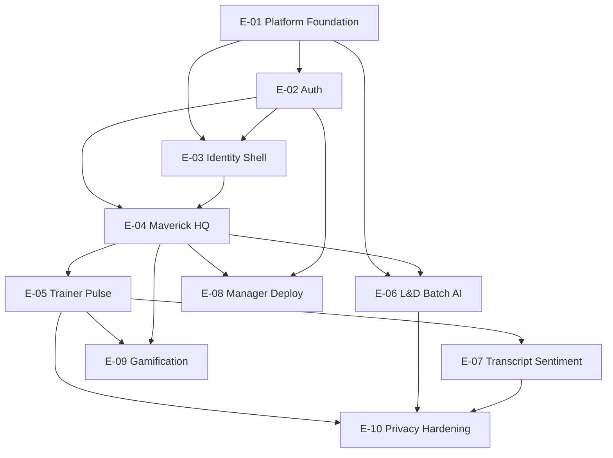

# NextSteps NEXUS Strategy — Epic Breakdown & Prioritized Roadmap

| Field | Value |
|-------|-------|
| **Document ID** | `nextsteps-nexus-strategy-epic-roadmap` |
| **Version** | 1.0.0 |
| **Status** | Strategy complete — Build gate open |
| **NEXUS phase** | Strategy ✓ → Build |
| **Parent directive** | ALSAA-1 |
| **Lead issue** | ALSAA-10 |
| **Authored by** | VP of Product |
| **Inputs** | `docs/nextsteps-maverick-platform-spec.md` v1.1.0, architecture appendix (ALSAA-5), UI/UX spec (ALSAA-9) |
| **Baseline version** | `0.0.0` (legacy Vite prototype, `package.json`) |
| **ADO execution** | Delegated to Scrum Master via ALSAA-11 |

---

## 1. Executive summary

CEO-approved Discovery (v1.1.0-consolidated) defines a **four-role MERN platform** replacing the frontend-only prototype. This document translates that spec into **10 prioritized epics**, maps them to **build phases P0–P6**, assigns **Paperclip build issues ALSAA-12–18**, and recommends **Sprint 1–2 themes** for `Lab AI Tools\Sprint N` cadence.

**Build sequencing principle:** Foundation → Maverick identity slice → Trainer feedback loop → L&D intelligence → Manager deployment continuity → Gamification polish. Cross-cutting epics (Platform Foundation, Identity Shell, Privacy/RBAC) gate all vertical slices.

---

## 2. Epic catalog

| Epic ID | Epic title | Priority | Build phase | Paperclip issue | Primary owner |
|---------|------------|:--------:|:-----------:|-----------------|---------------|
| **E-01** | Platform Foundation & DevOps | P0 | P0 | ALSAA-12 | VP Engineering |
| **E-02** | Authentication & Session Continuity | P0 | P0–P5 | ALSAA-12, ALSAA-17 | VP Engineering |
| **E-03** | Metaverse Identity Shell & Design System | P1 | P0–P1 | ALSAA-12, ALSAA-13 | Creative Director + FE |
| **E-04** | Maverick Mission HQ & Passport | P1 | P1 | ALSAA-13 | VP Engineering |
| **E-05** | Trainer Session & Pulse Intelligence | P2 | P2 | ALSAA-14 | VP Engineering |
| **E-06** | L&D Batch Operations & Document AI | P3 | P3 | ALSAA-15 | VP Engineering |
| **E-07** | Session Transcript & Sentiment Pipeline | P4 | P4 | ALSAA-16 | VP Engineering |
| **E-08** | Manager Deployment & Performance Loop | P5 | P5 | ALSAA-17 | VP Engineering |
| **E-09** | Gamification Engine | P6 | P6 | ALSAA-18 | VP Engineering |
| **E-10** | Privacy, RBAC & Compliance Hardening | Cross | Harden (parallel P2+) | — (Harden phase) | CTO + Security |

---

## 3. Epic definitions

### E-01 — Platform Foundation & DevOps

**Outcome:** Engineers can run `web` + `api` + `worker` locally and deploy to `dev` with MongoDB, Redis, and CI smoke tests.

| Attribute | Detail |
|-----------|--------|
| **Scope** | Monorepo scaffold (`nextsteps-web`, `nextsteps-api`, `nextsteps-worker`, `nextsteps-infra`); MongoDB connection; Redis/BullMQ shell; Express `/api/v1` health; env/secrets pattern; CI pipeline on `dev` |
| **Out of scope** | Feature routes beyond auth health; production IaC |
| **Key stories** | Monorepo layout; API bootstrap; worker queue registration; Docker-compose local stack; lint/test gates |
| **Exit criteria** | `GET /api/v1/health` returns 200; worker processes test job; CI green on PR |
| **Dependencies** | Open Q5 (hosting) — **stub with org standard, do not block scaffold** |
| **Risks** | Tailwind migration strategy undecided — **incremental alongside legacy CSS for P0–P1** |

### E-02 — Authentication & Session Continuity

**Outcome:** Four roles authenticate correctly; Mavericks have Gmail Magic Link pre-deploy with SSO stub ready for deployment flip.

| Attribute | Detail |
|-----------|--------|
| **Scope** | JWT issuance; RBAC middleware; Magic Link OTP flow; SSO redirect/callback stub; `authMode` claim; refresh token cookies; role resolution |
| **Out of scope** | HRIS deployment webhook (P5); production IdP cert rotation |
| **Key stories** | `/auth/magic-link`, `/auth/magic-link/verify`, `/auth/sso/login` stub, `/auth/logout`; JWT claims per architecture §4.2 |
| **Exit criteria** | Maverick demo login via magic link; Trainer/L&D/Manager via SSO stub; routes reject wrong role |
| **Dependencies** | E-01; Open Q1 (IdP protocol) — **stub OIDC, finalize in P5** |
| **Workflows** | W-A01 (auth transition — partial in P5) |

### E-03 — Metaverse Identity Shell & Design System

**Outcome:** Login and authenticated shell match metaverse UI spec; Mentor removed; role renames applied.

| Attribute | Detail |
|-----------|--------|
| **Scope** | 60-30-10 tokens; Tailwind token layer; LoginPage 4-role grid + lanyard teasers; SignInSplash tied to real session; Layout nav rename (`manager`, `ld_executive`); delete Mentor routes; Magic Bento + reduced-motion |
| **Out of scope** | Full Tailwind rewrite of every legacy page |
| **Key stories** | Design token migration; role picker (4 only); nav config cleanup; accessibility pass on login grid |
| **Exit criteria** | No Mentor references in UI/routes; WCAG AA on login; lanyard renders on login per role |
| **Dependencies** | E-01, E-02; ALSAA-9 design spec |
| **Legacy disposition** | Delete `MentorDashboard.jsx`; rename `supervisor/` → `manager/` |

### E-04 — Maverick Mission HQ & Passport

**Outcome:** Mavericks see live dashboard data from API; passport/lanyard reflects real profile.

| Attribute | Detail |
|-----------|--------|
| **Scope** | `/maverick/dashboard`, `/maverick/profile`, `/maverick/passport`, `/maverick/skill-tree`, `/maverick/phase-timeline`; wire mockData → API; R3F passport production-harden |
| **Out of scope** | AI Buddy (defer to P3+); leaderboard (P6) |
| **Key stories** | Dashboard API; profile CRUD; passport read model; phase timeline from `sessions` + `phases` |
| **Exit criteria** | Maverick logs in → dashboard loads from MongoDB; passport shows XP/skills/badges from API |
| **Dependencies** | E-01, E-02, E-03 |
| **Workflows** | W-M01 (missions shell), W-M05 (passport) |

### E-05 — Trainer Session & Pulse Intelligence

**Outcome:** Trainers log sessions, collect pulse feedback, view batch-aggregated pulse board (no named surveillance).

| Attribute | Detail |
|-----------|--------|
| **Scope** | Session logger CRUD; pulse submit + aggregate; batch pulse board; attendance; assessment publisher (CodePen embed ref); session analytics charts |
| **Out of scope** | Meet transcript (P4); confusion NLP (P4) |
| **Key stories** | `/trainer/sessions`, `/trainer/batches/:id/pulse`, `/maverick/feedback/pulse`, `/trainer/assessments` |
| **Exit criteria** | Session → Maverick pulse → Trainer sees aggregate only; assessment embed loads sandboxed |
| **Dependencies** | E-04 (Maverick feedback submit); E-02 |
| **Workflows** | W-M02, W-T01, W-T02, W-T03 |
| **Privacy** | k-anonymity n≥5 on confusion views |

### E-06 — L&D Batch Operations & Document AI

**Outcome:** L&D Executives upload cohort documents, trigger AI segregation, manage batch lifecycle.

| Attribute | Detail |
|-----------|--------|
| **Scope** | Document upload to encrypted storage; `parse-resume` job; `segregate-batch` job; batch CRUD; stream recommender; curriculum copilot shell |
| **Out of scope** | Full effectiveness analytics (partial); Meet integration |
| **Key stories** | `/ld/batches/segregate`, `/maverick/documents`, worker pipelines, `/ld/curriculum/insights` |
| **Exit criteria** | Upload resume → skills on profile; L&D publishes batch assignments |
| **Dependencies** | E-01 (worker), E-04; Open Q4 (LLM provider) — **abstract provider interface** |
| **Workflows** | W-L01 |

### E-07 — Session Transcript & Sentiment Pipeline

**Outcome:** Post-session Meet transcripts ingested; batch-level sentiment/confusion available to Trainer and L&D.

| Attribute | Detail |
|-----------|--------|
| **Scope** | Google Meet OAuth + webhook; `ingest-meet-transcript` job; `analyze-session-sentiment` job; transcript summary API; confusion threshold alerts |
| **Out of scope** | Live per-person monitoring |
| **Key stories** | Meet API integration; transcript storage + 90-day purge; batch aggregate endpoints |
| **Exit criteria** | Session ends → transcript summary within SLA; Trainer batch alert on threshold |
| **Dependencies** | E-05 (sessions exist); Open Q3 (Meet domain/scopes) |
| **Workflows** | Extends W-T02 |

### E-08 — Manager Deployment & Performance Loop

**Outcome:** Managers review assigned Mavericks; deployment triggers auth migration without data loss.

| Attribute | Detail |
|-----------|--------|
| **Scope** | Manager dashboard; read-only passport; performance reviews CRUD; early flags; `auth-provider-migrate` job; `/auth/link-sso`; deployment banner |
| **Out of scope** | HRIS source implementation details |
| **Key stories** | `/manager/*` routes; W-G01, W-G02; W-A01 full flow |
| **Exit criteria** | Deployment event flips `authMode`; Maverick re-login via SSO retains XP/history; Manager submits review |
| **Dependencies** | E-04, E-02; Open Q2 (HRIS webhook) — **manual admin trigger for dev** |
| **Workflows** | W-G01, W-G02, W-A01 |

### E-09 — Gamification Engine

**Outcome:** XP events, badges, streaks, and leaderboard cache drive engagement loops.

| Attribute | Detail |
|-----------|--------|
| **Scope** | XP ledger; badge rules; streak tracking; `compute-leaderboard` job; batch XP goals; daily missions |
| **Out of scope** | New game mechanics beyond spec |
| **Key stories** | XP on attendance/feedback/quiz; leaderboard API; badge award rules |
| **Exit criteria** | Attendance credits XP → leaderboard updates within nightly job; badges award on criteria |
| **Dependencies** | E-05 (attendance, assessments), E-04 |
| **Workflows** | W-M01 (missions complete) |

### E-10 — Privacy, RBAC & Compliance Hardening

**Outcome:** Platform meets spec §6 encryption, anonymization, and audit requirements before production pilot.

| Attribute | Detail |
|-----------|--------|
| **Scope** | Field-level encryption; audit logs on sensitive reads; k-anonymity enforcement; retention jobs; penetration review |
| **Out of scope** | Legal sign-off (HR/Legal) |
| **Key stories** | Audit middleware; document access logging; anonymization guards in analytics queries |
| **Exit criteria** | Privacy checklist from spec §6 passes internal review |
| **Dependencies** | E-05, E-06, E-07 (data exists to protect) |
| **Parallel start** | RBAC tests from P2 onward |

---

## 4. Dependency map

### Critical path

**E-01 → E-02 → E-03 → E-04 → E-05** is the minimum viable training loop (Maverick sees dashboard, Trainer runs session + pulse).

### Parallel tracks (after P1)

| Track | Epics | Can start when |
|-------|-------|----------------|
| **Manager / deploy** | E-08 | E-04 profile model stable |
| **L&D AI** | E-06 | E-01 worker + E-04 documents API |
| **Gamification** | E-09 | E-05 attendance + assessments |
| **Privacy** | E-10 | E-05 analytics endpoints exist |

---

## 5. Build phase → epic mapping (P0–P6)

| Phase | Theme | Epics | Paperclip | Target exit |
|-------|-------|-------|-----------|-------------|
| **P0** | MERN foundation + auth shell | E-01, E-02 (partial), E-03 (partial) | ALSAA-12 | Monorepo runs; SSO stub; 4-role login shell |
| **P1** | Maverick vertical slice | E-03 (complete), E-04 | ALSAA-13 | Maverick dashboard + passport from API |
| **P2** | Trainer feedback loop | E-05 | ALSAA-14 | Sessions + pulse aggregates live |
| **P3** | L&D batch intelligence | E-06 | ALSAA-15 | Resume parse + segregation |
| **P4** | Session intelligence | E-07 | ALSAA-16 | Meet transcript + sentiment |
| **P5** | Manager + deployment auth | E-08, E-02 (complete) | ALSAA-17 | SSO migration + reviews |
| **P6** | Gamification polish | E-09 | ALSAA-18 | Leaderboard + badges |
| **Harden** | Production readiness | E-10 | TBD | Privacy audit + load test |

---

## 6. Sprint theme recommendations (first 2 iterations)

**Cadence:** Mon–Fri `Lab AI Tools\Sprint N`; Friday semver Features per org standard (SM executes on ALSAA-11).

Assuming **Sprint 1** starts the first full dev week after Strategy sign-off:

### Sprint 1 — `Lab AI Tools\Sprint 1`

**Theme:** *“Foundation & First Login”*

| Focus | Epics | Deliverables |
|-------|-------|--------------|
| Scaffold | E-01 | Monorepo, MongoDB, Redis, CI smoke |
| Auth shell | E-02 | Magic link + SSO stub, JWT + RBAC |
| Shell cleanup | E-03 | 4-role login, Mentor removed, nav renames |

**Friday Feature (proposed):** `NextSteps Release 0.1.0 — MERN Foundation`

**Exit criteria:** Developer can clone, run stack, log in as any of 4 roles via stub auth.

### Sprint 2 — `Lab AI Tools\Sprint 2`

**Theme:** *“Maverick Mission HQ Live”*

| Focus | Epics | Deliverables |
|-------|-------|--------------|
| Maverick API | E-04 | Dashboard, profile, passport APIs |
| UI wire-up | E-03, E-04 | Passport lanyard + Mission HQ from MongoDB |
| Trainer prep | E-05 (spike) | Session model + API contract only |

**Friday Feature (proposed):** `NextSteps Release 0.2.0 — Maverick Identity Slice`

**Exit criteria:** Maverick end-to-end demo without mockData.json.

---

## 7. Version ladder (proposed)

| # | Friday (ISO) | Version | Bump | Theme / exit criteria |
|---|--------------|---------|------|------------------------|
| 0 | (shipped) | 0.0.0 | — | Legacy Vite prototype (Discovery reference) |
| 1 | 2026-06-06 | 0.1.0 | minor | MERN foundation + auth shell (P0 / Sprint 1) |
| 2 | 2026-06-13 | 0.2.0 | minor | Maverick dashboard + passport (P1 / Sprint 2) |
| 3 | 2026-06-20 | 0.3.0 | minor | Trainer session + pulse (P2) |
| 4 | 2026-06-27 | 0.4.0 | minor | L&D batch + document AI (P3) |
| 5 | 2026-07-04 | 0.5.0 | minor | Meet transcript + sentiment (P4) |
| 6 | 2026-07-11 | 0.6.0 | minor | Manager reviews + SSO migration (P5) |
| 7 | 2026-07-18 | 0.7.0 | minor | Gamification engine (P6) |
| 8 | 2026-07-25 | 1.0.0 | major | Hardening + pilot readiness (E-10) |

*Dates are illustrative — SM aligns to actual `Lab AI Tools\Sprint N` calendar on ALSAA-11.*

---

## 8. Paperclip issue traceability

| Paperclip | Phase | Epics | Epic stories (summary) |
|-----------|-------|-------|------------------------|
| **ALSAA-12** | P0 | E-01, E-02, E-03 | Monorepo, auth shell, login/nav cleanup |
| **ALSAA-13** | P1 | E-03, E-04 | Maverick APIs + dashboard/passport wire-up |
| **ALSAA-14** | P2 | E-05 | Session logger, pulse, assessments, attendance |
| **ALSAA-15** | P3 | E-06 | Document upload, parse/segregate jobs, L&D dashboard |
| **ALSAA-16** | P4 | E-07 | Meet integration, transcript, sentiment jobs |
| **ALSAA-17** | P5 | E-08, E-02 | Manager module, deployment auth migration |
| **ALSAA-18** | P6 | E-09 | XP ledger, badges, streaks, leaderboard cache |
| **ALSAA-11** | Strategy→Build | All | SM: ADO Feature ladder + Sprint N alignment |

---

## 9. Open questions — owners & gates

| # | Question | Owner | Gate impact | Mitigation until resolved |
|---|----------|-------|-------------|---------------------------|
| Q1 | Hexaware SSO protocol (OIDC vs SAML) + test tenant | DevOps + IT | P5 production SSO | OIDC stub in P0; config flag |
| Q2 | HRIS source for Deployment Day 0 webhook | HR + L&D Ops | P5 automated migration | Manual admin trigger in dev/staging |
| Q3 | Google Meet domain, OAuth scopes, retention | IT + L&D | P4 transcript ingest | Mock webhook + fixture transcripts in P4 dev |
| Q4 | Approved cloud LLM provider | Architecture Review Board | P3 AI features | Provider adapter interface; Azure OpenAI default assumption |
| Q5 | Hosting (Azure vs AWS) + `dev` CI pipeline | DevOps | P0 deploy target | Local docker-compose; defer cloud to Sprint 1 mid-week |
| Q6 | Tailwind migration (big-bang vs incremental) | Creative Director + FE Lead | P1 UI velocity | **Decision: incremental** — tokens first, page-by-page from P1 |

**Blocked items:** None for P0 start. Q1 and Q2 block **production** deployment auth only.

---

## 10. Release analysis handoff (→ Scrum Master, ALSAA-11)

> VP Product does not mutate ADO. Paste/adapt this section on ALSAA-11 for SM execution.

### Release analysis handoff

**Project:** NextSteps  
**Baseline version:** 0.0.0 (`package.json`)  
**Horizon:** 8 Friday milestones (0.1.0 → 1.0.0)  
**Cadence:** Mon–Fri `Lab AI Tools\Sprint N`; Friday semver Features

### Version ladder

See §7 table above.

### Per-release Feature rollups (ADO titles to create/update)

- **Feature:** `NextSteps Release 0.1.0 — MERN Foundation` — monorepo, auth shell, 4-role login; target Sprint 1 Friday; parent epic ALSAA-1
  - **Stories:** ALSAA-12 (+ child tasks from VP Engineering breakdown)
- **Feature:** `NextSteps Release 0.2.0 — Maverick Identity Slice` — dashboard + passport API; Sprint 2 Friday
  - **Stories:** ALSAA-13
- **Feature:** `NextSteps Release 0.3.0 — Trainer Pulse Loop` — sessions, pulse, assessments; Sprint 3 Friday
  - **Stories:** ALSAA-14
- **Feature:** `NextSteps Release 0.4.0 — L&D Batch Intelligence` — document AI, segregation; Sprint 4 Friday
  - **Stories:** ALSAA-15
- **Feature:** `NextSteps Release 0.5.0 — Session Intelligence` — Meet transcript, sentiment; Sprint 5 Friday
  - **Stories:** ALSAA-16
- **Feature:** `NextSteps Release 0.6.0 — Manager & Deployment Auth` — reviews, SSO migration; Sprint 6 Friday
  - **Stories:** ALSAA-17
- **Feature:** `NextSteps Release 0.7.0 — Gamification Engine` — XP, badges, leaderboard; Sprint 7 Friday
  - **Stories:** ALSAA-18
- **Feature:** `NextSteps Release 1.0.0 — Pilot Ready` — privacy hardening, load test; Sprint 8 Friday
  - **Stories:** TBD (Harden epic E-10)

### SM actions requested

- [ ] Create/update Friday Feature milestones per version ladder
- [ ] Link ALSAA-12–18 under respective Release Features
- [ ] Set iteration paths: Sprint 1 = ALSAA-12; Sprint 2 = ALSAA-13; etc.
- [ ] Paste feature changelog bullets (§11) into ADO Wiki release notes

**Reference doc:** `docs/nextsteps-nexus-strategy-epic-roadmap.md` (this document)

---

## 11. Feature changelog bullets (ADO Wiki — product-facing)

For SM to paste per release. Engineering owns technical changelog on merge to `dev`.

### 0.1.0 — MERN Foundation
- Added production monorepo structure for web, API, and background worker services
- Added JWT authentication shell with Magic Link and SSO stub for all four roles
- Removed Mentor role from navigation and routes; renamed Supervisor → Manager, L&D Manager → L&D Executive
- Established local development stack with MongoDB and job queue

### 0.2.0 — Maverick Identity Slice
- Mavericks now see live Mission HQ data from the platform backend
- Training passport and lanyard identity card reflect real profile, XP, and skills
- Phase timeline and skill tree connected to persistent storage

### 0.3.0 — Trainer Pulse Loop
- Trainers can log sessions and publish CodePen-based assessments
- Mavericks submit post-session pulse feedback; trainers see batch-aggregated insights only
- Attendance tracking integrated with session records

### 0.4.0 — L&D Batch Intelligence
- L&D Executives upload resumes and certificates with encrypted storage
- AI-assisted batch segregation proposes cohort assignments for executive approval
- Stream recommendations surfaced to Mavericks after onboarding parse

### 0.5.0 — Session Intelligence
- Google Meet transcripts ingested after training sessions
- Batch-level sentiment and confusion alerts help trainers respond within one session cycle
- Transcript summaries available to L&D for effectiveness analytics

### 0.6.0 — Manager & Deployment Auth
- Managers access read-only training passports and structured performance reviews
- Early performance flags surface risk signals for assigned Mavericks
- Deployment triggers seamless Gmail-to-SSO auth transition with zero profile data loss

### 0.7.0 — Gamification Engine
- XP ledger awards points for attendance, feedback, and assessments
- Badges, streaks, and batch leaderboards drive daily engagement
- Batch XP goals configurable by trainers and L&D

### 1.0.0 — Pilot Ready
- Privacy and RBAC hardening aligned to 2025 aggregate-analytics standards
- Audit logging on sensitive document and transcript access
- Load-tested for 50 concurrent Mavericks per batch

---

## 12. ADO epic titles (recommended for SM mirror)

| ADO Epic title | Maps to | Phase |
|----------------|---------|-------|
| `[NextSteps] E-01 Platform Foundation` | E-01 | P0 |
| `[NextSteps] E-02 Authentication & Session Continuity` | E-02 | P0–P5 |
| `[NextSteps] E-03 Metaverse Identity Shell` | E-03 | P0–P1 |
| `[NextSteps] E-04 Maverick Mission HQ` | E-04 | P1 |
| `[NextSteps] E-05 Trainer Pulse Intelligence` | E-05 | P2 |
| `[NextSteps] E-06 L&D Batch Operations` | E-06 | P3 |
| `[NextSteps] E-07 Session Transcript Pipeline` | E-07 | P4 |
| `[NextSteps] E-08 Manager Deployment Loop` | E-08 | P5 |
| `[NextSteps] E-09 Gamification Engine` | E-09 | P6 |
| `[NextSteps] E-10 Privacy & Compliance` | E-10 | Harden |

Parent epic: ALSAA-1 (NextSteps revamp directive).

---

## Appendix A — Revision history

| Version | Date | Author | Changes |
|---------|------|--------|---------|
| 1.0.0 | 2026-05-29 | VP Product (ALSAA-10) | Initial Strategy deliverable — epic breakdown, dependencies, sprint themes, SM handoff |

---

*Strategy gate complete. Next: SM executes ALSAA-11; VP Engineering starts ALSAA-12 (P0).*
